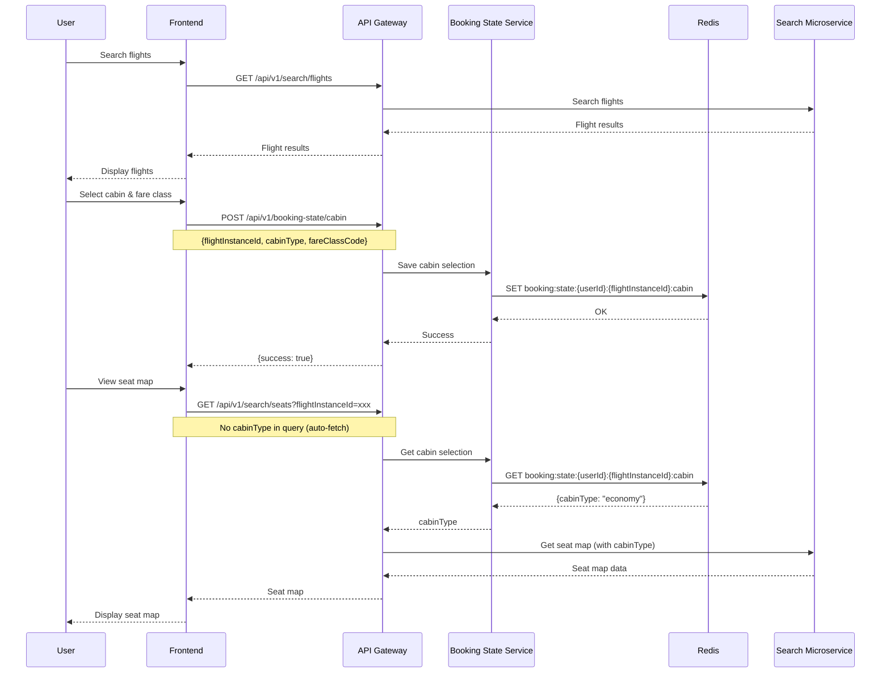
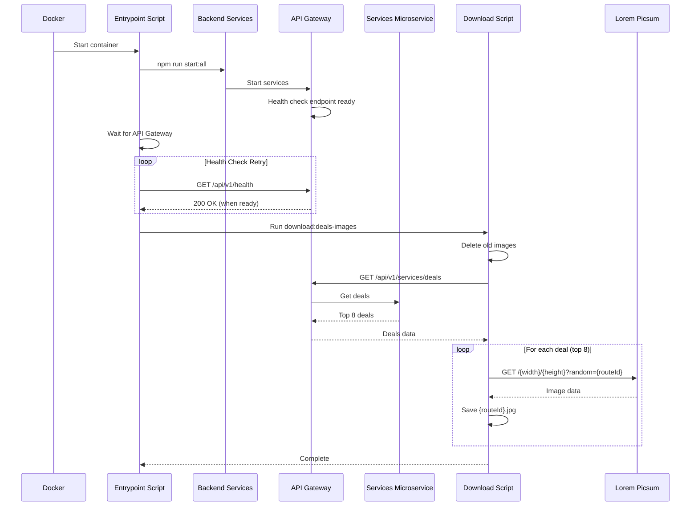
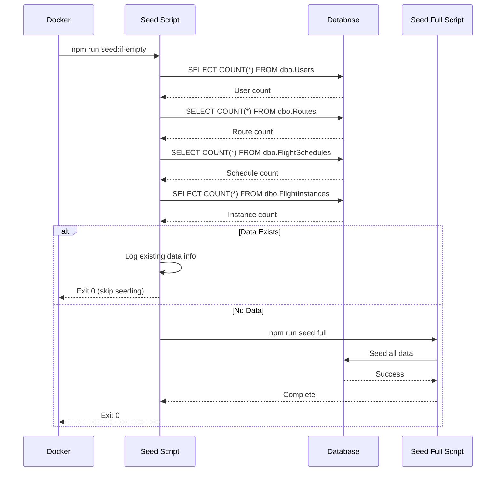
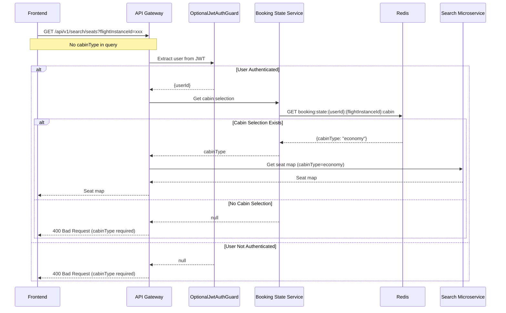
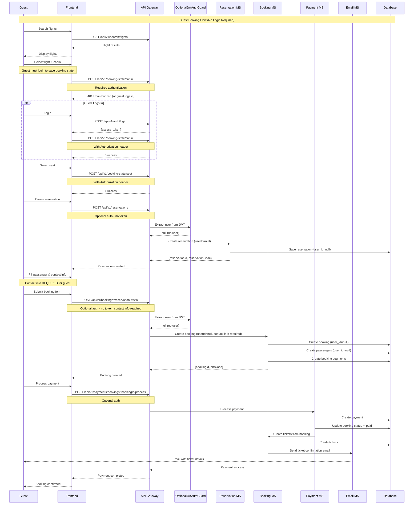
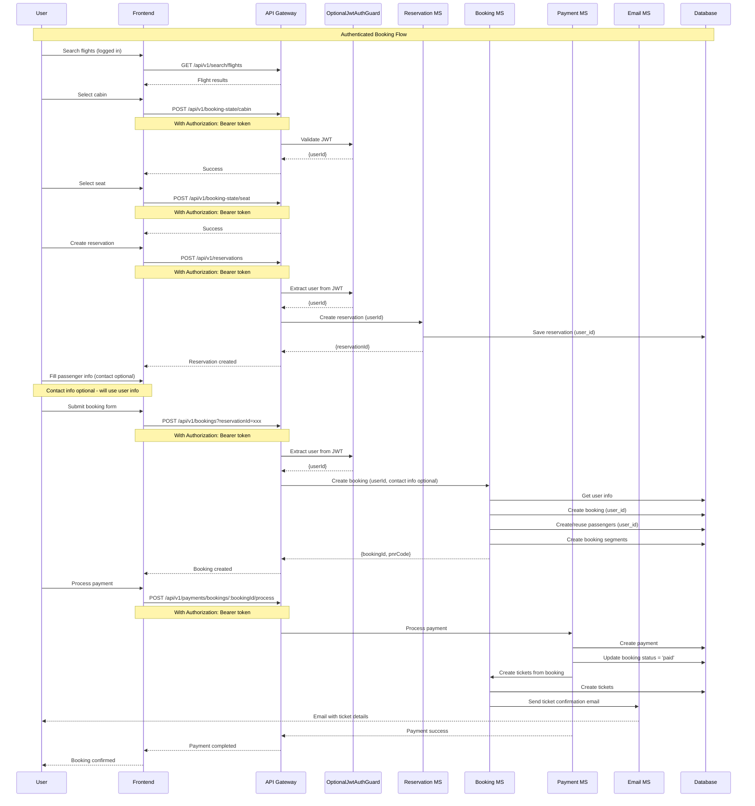

# API Sequence Diagrams

## Booking Flow with Auto-fetch Cabin Type

### Flow: Search → Select Cabin → View Seat Map (Auto-fetch)

## Deals Images Download Flow

### Flow: Docker Startup → Download Deals Images

## Conditional Database Seeding Flow

### Flow: Check Data → Seed if Empty

## Seat Map Auto-fetch Flow

### Flow: Get Seat Map with Auto-fetch Cabin Type

## Guest Booking Flow

### Flow: Guest User Creates Booking (No Authentication Required)

## Authenticated Booking Flow

### Flow: Authenticated User Creates Booking

