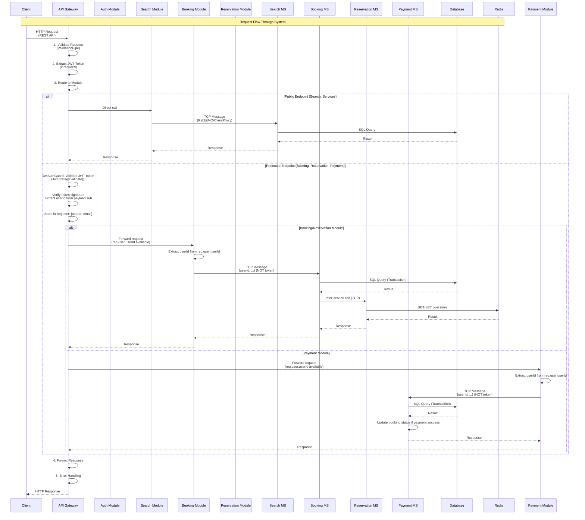
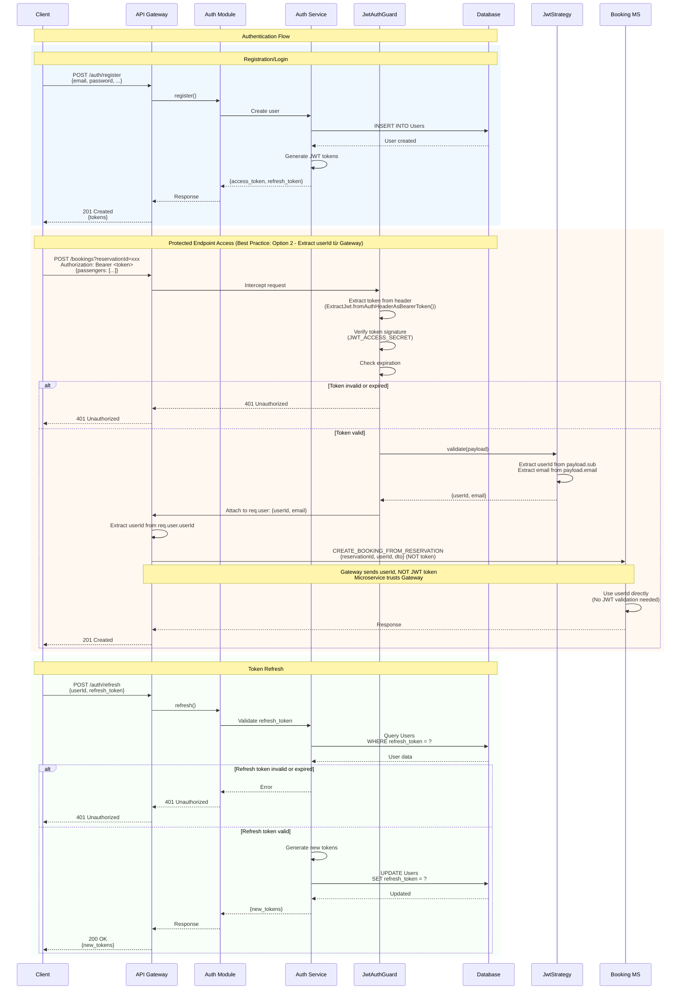
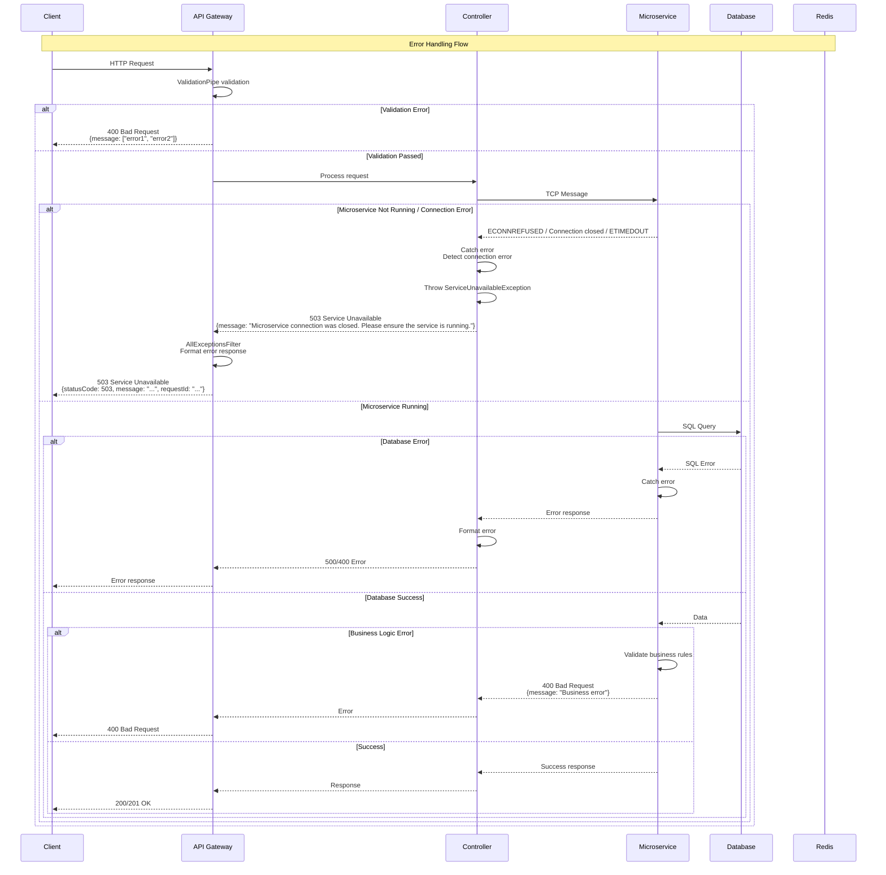
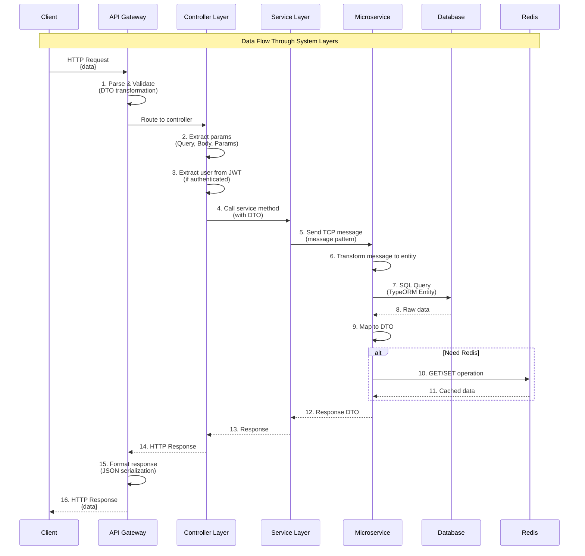

# System Sequence Diagrams - Flight Booking Backend

Tài liệu này chứa các sequence diagrams mô tả flow xử lý tổng thể của toàn bộ hệ thống ở mức architecture/system level.

---

## 1. Complete Booking Flow (End-to-End)

Sequence diagram mô tả toàn bộ flow từ khi user tìm kiếm chuyến bay đến khi hoàn tất booking:

```mermaid
sequenceDiagram
    participant Client
    participant API Gateway
    participant Auth Service
    participant Search MS
    participant Reservation MS
    participant Booking MS
    participant Payment MS
    participant Email MS
    participant Database
    participant Redis

    Note over Client,Redis: Phase 1: Authentication
    Client->>API Gateway: POST /auth/login<br/>{email, password}
    API Gateway->>Auth Service: Validate credentials
    Auth Service->>Database: Query Users table
    Database-->>Auth Service: User data
    Auth Service->>Auth Service: Generate JWT tokens
    Auth Service-->>API Gateway: {access_token, refresh_token}
    API Gateway-->>Client: 200 OK<br/>{access_token, refresh_token}
    Client->>Client: Store tokens

    Note over Client,Redis: Phase 2: Search Flights
    Client->>API Gateway: GET /search/flights<br/>?origin=HAN&destination=SGN&departDate=...
    API Gateway->>Search MS: SEARCH_FLIGHTS message (TCP)
    Search MS->>Database: Query FlightInstances, Routes, Airports
    Database-->>Search MS: Flight data
    Search MS->>Search MS: Calculate available seats
    Search MS-->>API Gateway: {tripType, outbound: [...]}
    API Gateway-->>Client: 200 OK<br/>{flights list}

    Note over Client,Redis: Phase 3: Get Fare Options
    Client->>API Gateway: GET /search/fare-options<br/>?flightInstanceId=xxx&cabinType=economy
    API Gateway->>Search MS: GET_FARE_OPTIONS message (TCP)
    Search MS->>Database: Query FareClasses, FlightSeats
    Database-->>Search MS: Fare classes & availability
    Search MS-->>API Gateway: [{fareClassCode, price, ...}]
    API Gateway-->>Client: 200 OK<br/>{fare options}

    Note over Client,Redis: Phase 3.5: Get Seat Map (Required - Seat Selection)
    Client->>API Gateway: GET /search/seats<br/>?flightInstanceId=xxx&cabinType=economy
    API Gateway->>Search MS: GET_SEAT_MAP message (TCP)
    Search MS->>Database: Query FlightSeats, SeatConfigurations<br/>Filter by cabin class
    Database-->>Search MS: Seat data with availability
    Search MS-->>API Gateway: {flightInstanceId, cabinType, seats: [{flightSeatId, seatNumber, isAvailable, ...}]}
    API Gateway-->>Client: 200 OK<br/>{seat map}

    Note over Client,Redis: Phase 3.6: Save Cabin Selection (Backend State Management)
    Client->>API Gateway: POST /booking-state/cabin<br/>Authorization: Bearer <token><br/>{flightInstanceId, cabinType, fareClassCode}
    API Gateway->>API Gateway: JwtAuthGuard: Validate JWT token<br/>Extract userId from payload
    API Gateway->>API Gateway: BookingStateService.saveCabinSelection()
    API Gateway->>Redis: SET booking:state:{userId}:{flightInstanceId}<br/>TTL: 1800 seconds (30 min)<br/>{cabin: {flightInstanceId, cabinType, fareClassCode}, updatedAt}
    Redis-->>API Gateway: OK
    API Gateway-->>Client: 200 OK<br/>{success: true, message: "Cabin selection saved successfully"}

    Note over Client,Redis: Phase 3.7: Save Seat Selection (Backend State Management - Required)
    Client->>API Gateway: POST /booking-state/seat<br/>Authorization: Bearer <token><br/>{flightInstanceId, flightSeatId, seatNumber}
    API Gateway->>API Gateway: JwtAuthGuard: Validate JWT token<br/>Extract userId from payload
    API Gateway->>API Gateway: BookingStateService.saveSeatSelection()
    API Gateway->>Redis: GET booking:state:{userId}:{flightInstanceId}
    Redis-->>API Gateway: Booking state (with cabin)
    alt Cabin not selected
        API Gateway-->>Client: 400 Bad Request<br/>{message: "Cabin not selected. Please select cabin first."}
    else Cabin selected
        API Gateway->>Redis: SET booking:state:{userId}:{flightInstanceId}<br/>TTL: 1800 seconds<br/>{cabin: {...}, seat: {flightInstanceId, flightSeatId, seatNumber}, updatedAt}
        Redis-->>API Gateway: OK
        API Gateway-->>Client: 200 OK<br/>{success: true, message: "Seat selection saved successfully"}
    end

    Note over Client,Redis: Phase 3.8: Get Booking State (Optional - Recommended Best Practice)
    Client->>API Gateway: GET /booking-state/:flightInstanceId<br/>Authorization: Bearer <token>
    API Gateway->>API Gateway: JwtAuthGuard: Validate JWT token<br/>Extract userId from payload
    API Gateway->>API Gateway: BookingStateService.getBookingState()
    API Gateway->>Redis: GET booking:state:{userId}:{flightInstanceId}
    alt Booking state not found
        Redis-->>API Gateway: null
        API Gateway-->>Client: 404 Not Found<br/>{message: "No booking state found for flight {flightInstanceId}"}
    else Booking state found
        Redis-->>API Gateway: {flightInstanceId, cabin: {...}, seat: {...}, updatedAt}
        API Gateway-->>Client: 200 OK<br/>{flightInstanceId, cabin, seat, updatedAt}
        Note right of Client: Frontend displays summary<br/>for user confirmation
    end

    Note over Client,Redis: Phase 4: Create Reservation (Backend Auto-Fetches Cabin + Seat from Redis)
    Client->>API Gateway: POST /reservations<br/>Authorization: Bearer <token><br/>{segments: [{flightInstanceId, segmentType}, ...], numberOfPassengers, currencyCode?}
    API Gateway->>API Gateway: JwtAuthGuard: Validate JWT token<br/>JwtStrategy: Extract userId from payload
    API Gateway->>API Gateway: Extract userId from req.user.userId
    API Gateway->>Reservation MS: CREATE_RESERVATION message (TCP)<br/>{userId, dto} (NOT token)
    Reservation MS->>Reservation MS: BookingStateService.getSelectionsForReservation()<br/>For each segment: flightInstanceId
    Reservation MS->>Redis: GET booking:state:{userId}:{flightInstanceId}
    alt Booking state not found or missing cabin/seat
        Redis-->>Reservation MS: null or incomplete state
        Reservation MS-->>API Gateway: 400 Bad Request<br/>{message: "Cabin/seat not selected. Please select cabin and seat first."}
        API Gateway-->>Client: 400 Bad Request
    else Booking state found with cabin + seat
        Redis-->>Reservation MS: {cabin: {fareClassCode, cabinType}, seat: {flightSeatId, seatNumber}}
        Reservation MS->>Database: Validate all segments (flight & fare class from cabin selection)
        Database-->>Reservation MS: Validation result for each segment
        Reservation MS->>Database: Validate seat (exists, available, correct flight & cabin)
        Database-->>Reservation MS: Seat validation result
        Reservation MS->>Database: UPDATE FlightSeats<br/>SET is_available = false<br/>WHERE flight_seat_id = :seatId
        Database-->>Reservation MS: Seat marked as unavailable (held)
        Reservation MS->>Reservation MS: Calculate price for each segment<br/>(using fareClassCode from cabin selection)<br/>Validate round-trip (if has inbound, must have outbound)
        Reservation MS->>Reservation MS: Generate reservationId & code
        Reservation MS->>Database: INSERT INTO Reservations<br/>(status: 'pending', segments_json with flightSeatId from seat selection, ...)
        Database-->>Reservation MS: Reservation saved
        Reservation MS->>Redis: SET reservation:{id}<br/>TTL: 900 seconds<br/>{segments: [...with flightSeatId], totalAmount, status: 'active', ...}
        Redis-->>Reservation MS: OK
        Reservation MS->>Reservation MS: BookingStateService.clearBookingState()<br/>Clear booking state after successful reservation (automatic cleanup)
        Reservation MS->>Redis: DEL booking:state:{userId}:{flightInstanceId}
        Redis-->>Reservation MS: OK
        Reservation MS-->>API Gateway: {reservationId, reservationCode, segments: [...with flightSeatId & seatNumber], totalAmount, ...}
        API Gateway-->>Client: 201 Created<br/>{reservationId, segments: [...with seat info], ...}
    end

    Note over Client,Redis: Phase 4.1: Clear Booking State (Optional - Manual Clear)
    alt User wants to start over (optional)
        Client->>API Gateway: DELETE /booking-state/:flightInstanceId<br/>Authorization: Bearer <token>
        API Gateway->>API Gateway: JwtAuthGuard: Validate JWT token<br/>Extract userId from payload
        API Gateway->>API Gateway: BookingStateService.clearBookingState()
        API Gateway->>Redis: DEL booking:state:{userId}:{flightInstanceId}
        alt State exists
            Redis-->>API Gateway: OK (deleted)
        else State not found
            Redis-->>API Gateway: OK (idempotent - no error)
        end
        API Gateway-->>Client: 204 No Content<br/>(Idempotent - can be called multiple times)
    end

    Note over Client,Redis: Phase 5: Create Booking (From Reservation - REQUIRED - Hybrid Approach)
    Client->>API Gateway: POST /bookings?reservationId=xxx<br/>Authorization: Bearer <token><br/>{passengers: [...], contactInfo}
    API Gateway->>API Gateway: JwtAuthGuard: Validate JWT token<br/>JwtStrategy: Extract userId from payload
    API Gateway->>API Gateway: Extract userId from req.user.userId<br/>Validate reservationId is provided
    API Gateway->>Booking MS: CREATE_BOOKING_FROM_RESERVATION message (TCP)<br/>{reservationId, userId, dto} (NOT token)
    Booking MS->>Reservation MS: GET_RESERVATION message (TCP)
    Reservation MS->>Redis: GET reservation:{id}
    alt Found in Redis
        Redis-->>Reservation MS: Reservation data (with segments array)
    else Not found in Redis (fallback to Database)
        Reservation MS->>Database: SELECT FROM Reservations<br/>WHERE reservation_id = :id
        Database-->>Reservation MS: Reservation entity
        Reservation MS->>Reservation MS: Convert entity to DTO<br/>Re-cache to Redis if active
    end
    Reservation MS-->>Booking MS: Reservation data (segments: [...])
    Booking MS->>Booking MS: Validate reservation<br/>(active/pending, not expired, ownership)
    Booking MS->>Database: BEGIN TRANSACTION
    Booking MS->>Database: Validate all segments from reservation.segments
    Booking MS->>Database: Create/Find Passengers
    Booking MS->>Database: Create Booking record
    Booking MS->>Database: Create BookingPassengers
    Booking MS->>Database: Create BookingSegments<br/>(from all reservation segments)<br/>Assign flight_seat if flightSeatId exists in reservation
    Booking MS->>Database: Calculate & update total_amount<br/>(from reservation.totalAmount)
    Booking MS->>Database: COMMIT TRANSACTION
    Database-->>Booking MS: Transaction committed
    Booking MS->>Reservation MS: MARK_RESERVATION_AS_CONVERTED message (TCP)
    Reservation MS->>Database: UPDATE Reservations<br/>SET status = 'converted', converted_at = now
    Database-->>Reservation MS: Updated
    Reservation MS->>Redis: DEL reservation:{id}
    Redis-->>Reservation MS: OK
    Reservation MS-->>Booking MS: Reservation marked as converted
    Booking MS->>Email MS: SEND_EMAIL message (TCP)<br/>{to, template: 'booking_confirmation', templateData}
    Email MS->>Email MS: Queue email (non-blocking)
    Email MS-->>Booking MS: {emailId, status: 'queued'}
    Booking MS-->>API Gateway: {bookingId, pnrCode, totalAmount}
    API Gateway-->>Client: 201 Created<br/>{bookingId, pnrCode, ...}

    Note over Client,Redis: Phase 6: Get Booking Details
    Client->>API Gateway: GET /bookings/:id/fare-details<br/>Authorization: Bearer <token>
    API Gateway->>Booking MS: GET_FARE_DETAILS message (TCP)
    Booking MS->>Database: Query BookingSegments, FareClasses
    Database-->>Booking MS: Booking & fare data
    Booking MS-->>API Gateway: {fareClassName, descriptions, ...}
    API Gateway-->>Client: 200 OK<br/>{fare details}

    Client->>API Gateway: GET /bookings/:id/payment-info<br/>Authorization: Bearer <token>
    API Gateway->>Booking MS: GET_PAYMENT_INFO message (TCP)
    Booking MS->>Database: Query Bookings
    Database-->>Booking MS: Booking data
    Booking MS-->>API Gateway: {totalAmount, contactInfo, ...}
    API Gateway-->>Client: 200 OK<br/>{payment info}

    Note over Client,Redis: Phase 7: Process Payment (NEW - Production Ready)
    Client->>API Gateway: POST /payments/bookings/:bookingId/process<br/>Authorization: Bearer <token><br/>{paymentMethodCode, idempotencyKey?, amount?}
    API Gateway->>API Gateway: JwtAuthGuard: Validate JWT token<br/>JwtStrategy: Extract userId from payload
    API Gateway->>API Gateway: Extract userId from req.user.userId
    API Gateway->>Payment MS: PROCESS_PAYMENT message (TCP)<br/>{userId, bookingId, dto} (NOT token)
    Payment MS->>Database: BEGIN TRANSACTION (WITH LOCK)
    Payment MS->>Database: Lock booking row (UPDLOCK, ROWLOCK)<br/>Validate booking exists & belongs to user<br/>Check booking status (not paid, not cancelled)
    Database-->>Payment MS: Booking data (locked)
    alt Idempotency Key Provided (Hybrid Approach)
        Payment MS->>Redis: Check idempotency key (fast path)<br/>GET idempotency:{key}
        alt Redis Hit (99% cases, ~1ms)
            Redis-->>Payment MS: Cached payment response
            Payment MS->>Payment MS: Verify booking ID matches
            Payment MS->>Database: Get payment by payment_id (for consistency)
            Database-->>Payment MS: Payment data
            Payment MS->>Database: COMMIT TRANSACTION
            Payment MS-->>API Gateway: Return existing payment (idempotent)
        else Redis Miss → DB Fallback
            Payment MS->>Database: Check idempotency key (guarantee path)<br/>SELECT * FROM Payments WHERE idempotency_key = :key
            alt DB Hit
                Database-->>Payment MS: Existing payment
                Payment MS->>Redis: Cache payment response (TTL: 2h)
                Payment MS->>Database: COMMIT TRANSACTION
                Payment MS-->>API Gateway: Return existing payment (idempotent)
            else DB Miss → Create New Payment
                Payment MS->>Database: Validate payment method exists & active<br/>Validate amount = booking total
            end
        end
    else No Idempotency Key
        Payment MS->>Database: Validate payment method exists & active<br/>Validate amount = booking total
    end
    Database-->>Payment MS: PaymentMethod data
    Payment MS->>Payment MS: Create Payment record<br/>(status: pending, expires_at: now + 15min)
    Payment MS->>Database: INSERT INTO Payments<br/>(payment_id, booking_id, amount, status: 'pending', expires_at, idempotency_key, ...)
    Database-->>Payment MS: Payment created
    alt Idempotency Key Provided
        Payment MS->>Redis: Cache payment response (non-blocking)<br/>SET idempotency:{key} (TTL: 2h)
        Note right of Redis: Redis failure does not block payment creation
    end
    Payment MS->>Payment MS: Call Payment Gateway<br/>(VNPay, MoMo, Stripe, etc.)
    Payment MS->>Payment Gateway: Create payment request<br/>(In production: HTTP API call)
    Payment Gateway-->>Payment MS: {transactionId, paymentUrl, status: 'pending'}
    Payment MS->>Database: UPDATE Payments<br/>SET transaction_ref = :transactionId
    Database-->>Payment MS: Payment updated
    Payment MS->>Payment MS: Send payment pending notification
    Payment MS->>Database: COMMIT TRANSACTION
    Database-->>Payment MS: Transaction committed
    Payment MS-->>API Gateway: {paymentId, bookingId, status: 'pending', paymentUrl, expiresAt, ...}
    API Gateway-->>Client: 201 Created<br/>{payment details with paymentUrl}<br/>Client redirects to paymentUrl
    
    Note over Client,Redis: Phase 8: Payment Gateway Webhook (Async)
    Payment Gateway->>API Gateway: POST /payments/webhooks/:gateway<br/>x-signature: <signature><br/>{transactionId, status: 'success/failed', ...}
    API Gateway->>Payment MS: HANDLE_WEBHOOK message (TCP)<br/>{gateway, signature, payload}
    Payment MS->>Payment MS: Verify webhook signature<br/>Validate request from gateway
    Payment MS->>Database: BEGIN TRANSACTION
    Payment MS->>Database: Find payment by transaction_ref
    Database-->>Payment MS: Payment data
    Payment MS->>Payment MS: Update payment status<br/>(status: success/failed, paid_at: now if success)
    Payment MS->>Database: UPDATE Payments<br/>SET status = :status, paid_at = :paidAt
    Database-->>Payment MS: Payment updated
    alt Payment Success
        Payment MS->>Database: UPDATE Bookings<br/>SET status = 'paid', updated_at = now
        Database-->>Payment MS: Booking updated
        Payment MS->>Email MS: SEND_EMAIL message (TCP)<br/>{to, template: 'payment_success', templateData}
        Email MS->>Email MS: Queue email (non-blocking)
        Email MS-->>Payment MS: {emailId, status: 'queued'}
    else Payment Failed
        Payment MS->>Email MS: SEND_EMAIL message (TCP)<br/>{to, template: 'payment_failed', templateData}
        Email MS->>Email MS: Queue email (non-blocking)
        Email MS-->>Payment MS: {emailId, status: 'queued'}
    end
    Payment MS->>Database: COMMIT TRANSACTION
    Database-->>Payment MS: Transaction committed
    Note over Payment MS,Email MS: Email notifications are sent non-blocking<br/>Payment flow continues even if email fails
    Payment MS-->>API Gateway: {success: true}
    API Gateway-->>Payment Gateway: 200 OK
    
    Note over Email MS: Email Processing (Async)
    Email MS->>Email MS: Process queue (background)
    Email MS->>Gmail API: Send email via Gmail API
    Gmail API-->>Email MS: Email sent successfully
    Email MS->>Email MS: Update status: 'sent'<br/>{success: true}
```

---

## 2. System Architecture Flow

Sequence diagram mô tả kiến trúc tổng thể và cách các components tương tác:



---

## 3. Microservices Communication Pattern

Sequence diagram mô tả pattern giao tiếp giữa các microservices:

```mermaid
sequenceDiagram
    participant API Gateway
    participant Search MS
    participant Booking MS
    participant Reservation MS
    participant Payment MS
    participant Services MS
    participant Routes MS
    participant Database
    participant Redis

    Note over API Gateway,Redis: Microservices Communication via TCP/RabbitMQ

    rect rgb(240, 248, 255)
        Note over API Gateway,Search MS: Direct Request-Response Pattern
        API Gateway->>Search MS: SEARCH_FLIGHTS message
        Search MS->>Database: Query
        Database-->>Search MS: Data
        Search MS-->>API Gateway: Response
    end

    rect rgb(255, 248, 240)
        Note over API Gateway,Reservation MS: Request-Response with Hybrid (Database + Redis)
        API Gateway->>Reservation MS: CREATE_RESERVATION message
        Reservation MS->>Database: Validate segments
        Database-->>Reservation MS: Validation
        Reservation MS->>Database: INSERT INTO Reservations (persistent)
        Database-->>Reservation MS: Saved
        Reservation MS->>Redis: SET reservation:{id} (cache, TTL)
        Redis-->>Reservation MS: OK
        Reservation MS-->>API Gateway: Response
    end

    rect rgb(248, 255, 248)
        Note over Booking MS,Reservation MS: Inter-Service Communication (Hybrid Approach)
        API Gateway->>Booking MS: CREATE_BOOKING message
        Booking MS->>Reservation MS: GET_RESERVATION message
        Reservation MS->>Redis: GET reservation:{id}
        alt Found in Redis
            Redis-->>Reservation MS: Data
        else Not found (fallback)
            Reservation MS->>Database: SELECT FROM Reservations
            Database-->>Reservation MS: Reservation entity
            Reservation MS->>Redis: Re-cache if active
        end
        Reservation MS-->>Booking MS: Reservation data
        Booking MS->>Database: Transaction
        Database-->>Booking MS: Result
        Booking MS->>Reservation MS: MARK_RESERVATION_AS_CONVERTED message
        Reservation MS->>Database: UPDATE status = 'converted'
        Reservation MS->>Redis: DEL reservation:{id}
        Redis-->>Reservation MS: OK
        Reservation MS-->>Booking MS: Marked as converted
        Booking MS-->>API Gateway: Response
    end

    rect rgb(255, 240, 245)
        Note over API Gateway,Services MS: Aggregation Pattern
        API Gateway->>Services MS: GET_DEALS message
        Services MS->>Database: Query Routes
        Database-->>Services MS: Routes
        loop For each route
            Services MS->>Database: Query Flights
            Database-->>Services MS: Flights
            Services MS->>Database: Calculate average price
            Database-->>Services MS: Price
        end
        Services MS->>Services MS: Aggregate & format
        Services MS-->>API Gateway: Aggregated response
    end

    rect rgb(255, 248, 240)
        Note over API Gateway,Payment MS: Payment Processing Pattern (Production Ready - Phase 1 & 2)
        API Gateway->>Payment MS: PROCESS_PAYMENT message<br/>{userId, bookingId, dto: {idempotencyKey?, amount?}}
        Payment MS->>Database: BEGIN TRANSACTION (WITH LOCK)
        Payment MS->>Database: Lock booking row (UPDLOCK, ROWLOCK)<br/>Validate booking exists & belongs to user<br/>Check payment method active & amount
        Database-->>Payment MS: Validation result (locked)
        alt Idempotency Key Provided (Hybrid Approach)
            Payment MS->>Redis: Check idempotency key (fast path, ~1ms)<br/>GET idempotency:{key}
            alt Redis Hit (99% cases)
                Redis-->>Payment MS: Cached payment response
                Payment MS->>Database: COMMIT TRANSACTION
                Payment MS-->>API Gateway: Return existing payment
            else Redis Miss → DB Fallback
                Payment MS->>Database: Check idempotency key (guarantee path)<br/>SELECT * FROM Payments WHERE idempotency_key = :key
                alt DB Hit
                    Database-->>Payment MS: Existing payment
                    Payment MS->>Redis: Cache payment response (TTL: 2h)
                    Payment MS->>Database: COMMIT TRANSACTION
                    Payment MS-->>API Gateway: Return existing payment
                else DB Miss → Create New Payment
                    Payment MS->>Database: INSERT INTO Payments<br/>(status: 'pending', expires_at: now + 15min, idempotency_key)
                    Database-->>Payment MS: Payment created
                    Payment MS->>Redis: Cache payment response (non-blocking)<br/>SET idempotency:{key} (TTL: 2h)
                    Note right of Redis: Redis failure does not block payment creation
                end
            end
        else No Idempotency Key
            Payment MS->>Database: INSERT INTO Payments<br/>(status: 'pending', expires_at: now + 15min)
            Database-->>Payment MS: Payment created
        end
        Payment MS->>Payment MS: Call Payment Gateway Factory<br/>Get gateway instance (VNPay, MoMo, Stripe, etc.)
        Payment MS->>Payment Gateway: createPayment()<br/>(In production: HTTP API call)
        Payment Gateway-->>Payment MS: {transactionId, paymentUrl, status: 'pending'}
        Payment MS->>Database: UPDATE Payments<br/>SET transaction_ref = :transactionId
        Database-->>Payment MS: Payment updated
        Payment MS->>Payment MS: Send payment pending notification
        Payment MS->>Database: COMMIT TRANSACTION
        Database-->>Payment MS: Transaction committed
        Payment MS-->>API Gateway: {paymentId, paymentUrl, expiresAt, ...}
        
        Note over Payment Gateway,Payment MS: Webhook Flow (Async)
        Payment Gateway->>API Gateway: POST /payments/webhooks/:gateway<br/>x-signature: <signature><br/>{transactionId, status}
        API Gateway->>Payment MS: HANDLE_WEBHOOK message<br/>{gateway, signature, payload}
        Payment MS->>Payment MS: Verify webhook signature
        Payment MS->>Database: Find payment by transaction_ref
        Payment MS->>Database: UPDATE Payments<br/>SET status = :status, paid_at = now
        alt Payment Success
            Payment MS->>Database: UPDATE Bookings<br/>SET status = 'paid'
            Payment MS->>Payment MS: Send payment success notification
        end
        Payment MS-->>API Gateway: {success: true}
    end
```



---

## 4. Authentication & Authorization Flow

Sequence diagram mô tả flow authentication và authorization trong hệ thống:



---

## 5. Error Handling Flow

Sequence diagram mô tả cách hệ thống xử lý errors:



---

## 6. Data Flow Through System

Sequence diagram mô tả luồng dữ liệu qua các layers của hệ thống:



---

## Notes

1. **Microservice Communication**: Tất cả communication giữa API Gateway và Microservices sử dụng TCP (RabbitMQ hoặc TCP socket) với message patterns.

2. **Transaction Safety**: Booking creation sử dụng database transaction để đảm bảo tính nhất quán dữ liệu.

3. **Reservation Storage (Hybrid Approach)**: 
   - **Database**: Persistent storage, audit trail, analytics (status: `pending`, `expired`, `converted`, `cancelled`)
   - **Redis**: Fast cache với TTL 15 phút (900 seconds), tự động expire
   - **Get Flow**: Try Redis first (fast) → Fallback to Database → Re-cache if needed
   - **Recovery**: Nếu Redis down, vẫn có thể lấy reservation từ Database

4. **Error Handling**: Tất cả các layers đều có error handling và trả về appropriate HTTP status codes.

5. **JWT Authentication (Best Practice: Option 2 - Extract userId từ Gateway)**:
   - **Gateway**: Validate JWT một lần, extract `userId` từ payload
   - **Gateway → Microservices**: Send `userId` (NOT JWT token)
   - **Microservices**: Trust Gateway, use `userId` directly (no JWT validation)
   - **Benefits**: Performance (validate once), Security (JWT secret only at Gateway), Simplicity (microservices don't need JWT logic)
   - **Xem thêm**: `docs/design/JWT_MICROSERVICES_PATTERN.md` và `docs/design/JWT_IMPLEMENTATION_SUMMARY.md`

6. **UUID v7**: Tất cả IDs được generate là UUID v7 (time-ordered UUID) để tối ưu database indexing.

7. **Data Transformation**: Dữ liệu được transform qua các layers: HTTP Request → DTO → Entity → Database → Entity → DTO → HTTP Response.
