# API Sequence Diagrams

## Airport List Fetch Flow

### Flow: Frontend → Next.js API Route → Backend API Gateway → Search Microservice

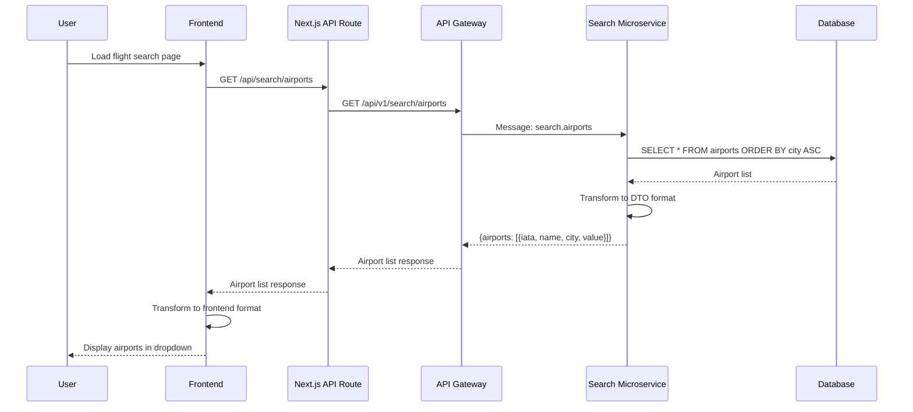
```mermaid
sequenceDiagram
    participant User
    participant Frontend
    participant Next.js API Route
    participant API Gateway
    participant Search Microservice
    participant Database

    User->>Frontend: Load flight search page
    Frontend->>Next.js API Route: GET /api/search/airports
    Next.js API Route->>API Gateway: GET /api/v1/search/airports
    API Gateway->>Search Microservice: Message: search.airports
    Search Microservice->>Database: SELECT * FROM airports ORDER BY city ASC
    Database-->>Search Microservice: Airport list
    Search Microservice->>Search Microservice: Transform to DTO format
    Search Microservice-->>API Gateway: {airports: [{iata, name, city, value}]}
    API Gateway-->>Next.js API Route: Airport list response
    Next.js API Route-->>Frontend: Airport list response
    Frontend->>Frontend: Transform to frontend format
    Frontend-->>User: Display airports in dropdown
```

## Flight Search Pre-validation Flow

### Flow: User Search → Pre-validate → Navigate or Show Toast

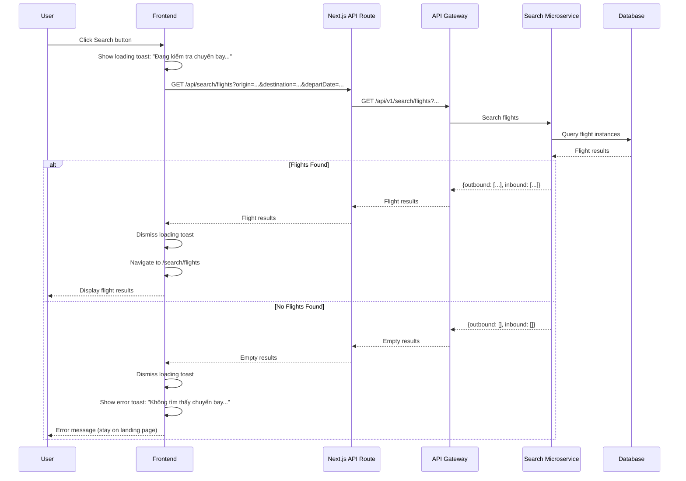
```mermaid
sequenceDiagram
    participant User
    participant Frontend
    participant Next.js API Route
    participant API Gateway
    participant Search Microservice
    participant Database

    User->>Frontend: Click Search button
    Frontend->>Frontend: Show loading toast: "Đang kiểm tra chuyến bay..."
    Frontend->>Next.js API Route: GET /api/search/flights?origin=...&destination=...&departDate=...
    Next.js API Route->>API Gateway: GET /api/v1/search/flights?...
    API Gateway->>Search Microservice: Search flights
    Search Microservice->>Database: Query flight instances
    Database-->>Search Microservice: Flight results
    
    alt Flights Found
        Search Microservice-->>API Gateway: {outbound: [...], inbound: [...]}
        API Gateway-->>Next.js API Route: Flight results
        Next.js API Route-->>Frontend: Flight results
        Frontend->>Frontend: Dismiss loading toast
        Frontend->>Frontend: Navigate to /search/flights
        Frontend-->>User: Display flight results
    else No Flights Found
        Search Microservice-->>API Gateway: {outbound: [], inbound: []}
        API Gateway-->>Next.js API Route: Empty results
        Next.js API Route-->>Frontend: Empty results
        Frontend->>Frontend: Dismiss loading toast
        Frontend->>Frontend: Show error toast: "Không tìm thấy chuyến bay..."
        Frontend-->>User: Error message (stay on landing page)
    end
```

## Booking Flow with Auto-fetch Cabin Type

### Flow: Search → Select Cabin → View Seat Map (Auto-fetch)

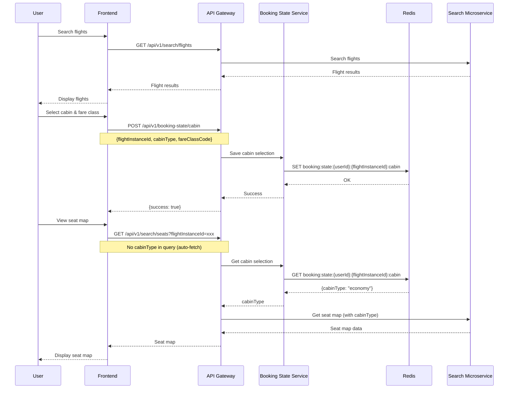
```mermaid
sequenceDiagram
    participant User
    participant Frontend
    participant API Gateway
    participant Booking State Service
    participant Redis
    participant Search Microservice

    User->>Frontend: Search flights
    Frontend->>API Gateway: GET /api/v1/search/flights
    API Gateway->>Search Microservice: Search flights
    Search Microservice-->>API Gateway: Flight results
    API Gateway-->>Frontend: Flight results
    Frontend-->>User: Display flights

    User->>Frontend: Select cabin & fare class
    Frontend->>API Gateway: POST /api/v1/booking-state/cabin
    Note over Frontend,API Gateway: {flightInstanceId, cabinType, fareClassCode}
    API Gateway->>Booking State Service: Save cabin selection
    Booking State Service->>Redis: SET booking:state:{userId}:{flightInstanceId}:cabin
    Redis-->>Booking State Service: OK
    Booking State Service-->>API Gateway: Success
    API Gateway-->>Frontend: {success: true}

    User->>Frontend: View seat map
    Frontend->>API Gateway: GET /api/v1/search/seats?flightInstanceId=xxx
    Note over Frontend,API Gateway: No cabinType in query (auto-fetch)
    API Gateway->>Booking State Service: Get cabin selection
    Booking State Service->>Redis: GET booking:state:{userId}:{flightInstanceId}:cabin
    Redis-->>Booking State Service: {cabinType: "economy"}
    Booking State Service-->>API Gateway: cabinType
    API Gateway->>Search Microservice: Get seat map (with cabinType)
    Search Microservice-->>API Gateway: Seat map data
    API Gateway-->>Frontend: Seat map
    Frontend-->>User: Display seat map
```

## Deals Images Download Flow

### Flow: Docker Startup → Download Deals Images

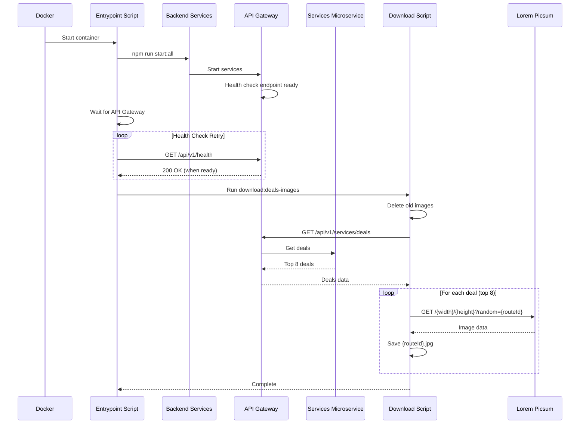
```mermaid
sequenceDiagram
    participant Docker
    participant Entrypoint Script
    participant Backend Services
    participant API Gateway
    participant Services Microservice
    participant Download Script
    participant Lorem Picsum

    Docker->>Entrypoint Script: Start container
    Entrypoint Script->>Backend Services: npm run start:all
    Backend Services->>API Gateway: Start services
    API Gateway->>API Gateway: Health check endpoint ready

    Entrypoint Script->>Entrypoint Script: Wait for API Gateway
    loop Health Check Retry
        Entrypoint Script->>API Gateway: GET /api/v1/health
        API Gateway-->>Entrypoint Script: 200 OK (when ready)
    end

    Entrypoint Script->>Download Script: Run download:deals-images
    Download Script->>Download Script: Delete old images
    Download Script->>API Gateway: GET /api/v1/services/deals
    API Gateway->>Services Microservice: Get deals
    Services Microservice-->>API Gateway: Top 8 deals
    API Gateway-->>Download Script: Deals data

    loop For each deal (top 8)
        Download Script->>Lorem Picsum: GET /{width}/{height}?random={routeId}
        Lorem Picsum-->>Download Script: Image data
        Download Script->>Download Script: Save {routeId}.jpg
    end

    Download Script-->>Entrypoint Script: Complete
```

## Conditional Database Seeding Flow

### Flow: Check Data → Seed if Empty

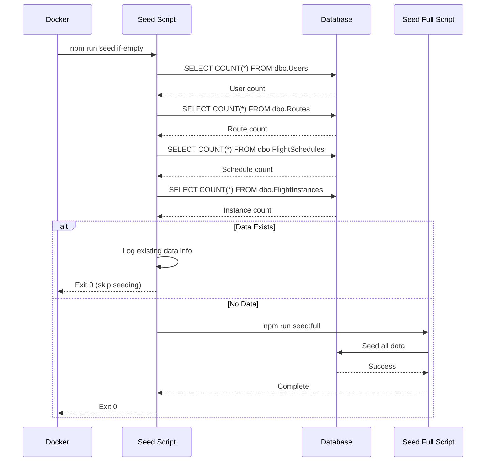
```mermaid
sequenceDiagram
    participant Docker
    participant Seed Script
    participant Database
    participant Seed Full Script

    Docker->>Seed Script: npm run seed:if-empty
    Seed Script->>Database: SELECT COUNT(*) FROM dbo.Users
    Database-->>Seed Script: User count
    Seed Script->>Database: SELECT COUNT(*) FROM dbo.Routes
    Database-->>Seed Script: Route count
    Seed Script->>Database: SELECT COUNT(*) FROM dbo.FlightSchedules
    Database-->>Seed Script: Schedule count
    Seed Script->>Database: SELECT COUNT(*) FROM dbo.FlightInstances
    Database-->>Seed Script: Instance count

    alt Data Exists
        Seed Script->>Seed Script: Log existing data info
        Seed Script-->>Docker: Exit 0 (skip seeding)
    else No Data
        Seed Script->>Seed Full Script: npm run seed:full
        Seed Full Script->>Database: Seed all data
        Database-->>Seed Full Script: Success
        Seed Full Script-->>Seed Script: Complete
        Seed Script-->>Docker: Exit 0
    end
```

## Seat Map Auto-fetch Flow

### Flow: Get Seat Map with Auto-fetch Cabin Type

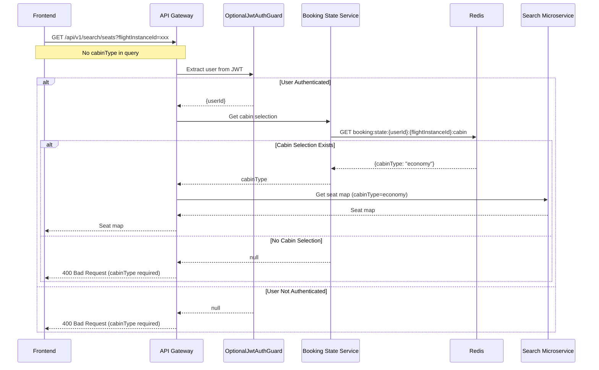
```mermaid
sequenceDiagram
    participant Frontend
    participant API Gateway
    participant OptionalJwtAuthGuard
    participant Booking State Service
    participant Redis
    participant Search Microservice

    Frontend->>API Gateway: GET /api/v1/search/seats?flightInstanceId=xxx
    Note over Frontend,API Gateway: No cabinType in query

    API Gateway->>OptionalJwtAuthGuard: Extract user from JWT
    alt User Authenticated
        OptionalJwtAuthGuard-->>API Gateway: {userId}
        API Gateway->>Booking State Service: Get cabin selection
        Booking State Service->>Redis: GET booking:state:{userId}:{flightInstanceId}:cabin
        alt Cabin Selection Exists
            Redis-->>Booking State Service: {cabinType: "economy"}
            Booking State Service-->>API Gateway: cabinType
            API Gateway->>Search Microservice: Get seat map (cabinType=economy)
            Search Microservice-->>API Gateway: Seat map
            API Gateway-->>Frontend: Seat map
        else No Cabin Selection
            Booking State Service-->>API Gateway: null
            API Gateway-->>Frontend: 400 Bad Request (cabinType required)
        end
    else User Not Authenticated
        OptionalJwtAuthGuard-->>API Gateway: null
        API Gateway-->>Frontend: 400 Bad Request (cabinType required)
    end
```

## Guest Booking Flow

### Flow: Guest User Creates Booking (No Authentication Required)

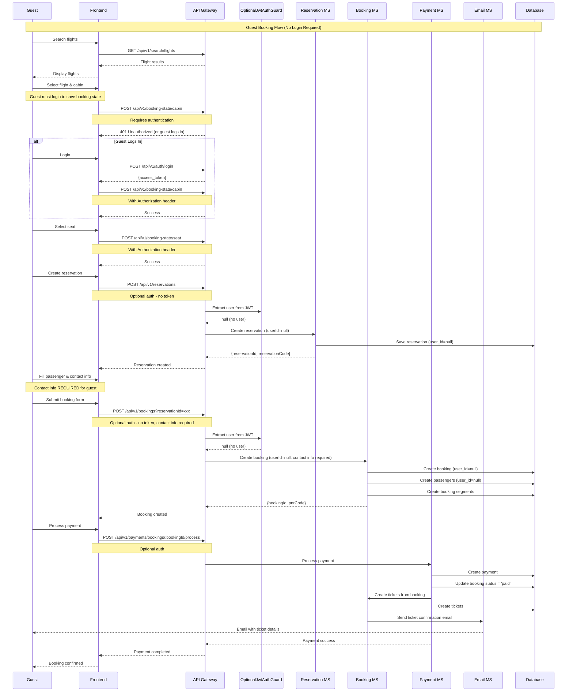
```mermaid
sequenceDiagram
    participant Guest
    participant Frontend
    participant API Gateway
    participant OptionalJwtAuthGuard
    participant Reservation MS
    participant Booking MS
    participant Payment MS
    participant Email MS
    participant Database

    Note over Guest,Database: Guest Booking Flow (No Login Required)

    Guest->>Frontend: Search flights
    Frontend->>API Gateway: GET /api/v1/search/flights
    API Gateway-->>Frontend: Flight results
    Frontend-->>Guest: Display flights

    Guest->>Frontend: Select flight & cabin
    Note over Guest,Frontend: Guest must login to save booking state
    Frontend->>API Gateway: POST /api/v1/booking-state/cabin
    Note over Frontend,API Gateway: Requires authentication
    API Gateway-->>Frontend: 401 Unauthorized (or guest logs in)

    alt Guest Logs In
        Guest->>Frontend: Login
        Frontend->>API Gateway: POST /api/v1/auth/login
        API Gateway-->>Frontend: {access_token}
        Frontend->>API Gateway: POST /api/v1/booking-state/cabin
        Note over Frontend,API Gateway: With Authorization header
        API Gateway-->>Frontend: Success
    end

    Guest->>Frontend: Select seat
    Frontend->>API Gateway: POST /api/v1/booking-state/seat
    Note over Frontend,API Gateway: With Authorization header
    API Gateway-->>Frontend: Success

    Guest->>Frontend: Create reservation
    Frontend->>API Gateway: POST /api/v1/reservations
    Note over Frontend,API Gateway: Optional auth - no token
    API Gateway->>OptionalJwtAuthGuard: Extract user from JWT
    OptionalJwtAuthGuard-->>API Gateway: null (no user)
    API Gateway->>Reservation MS: Create reservation (userId=null)
    Reservation MS->>Database: Save reservation (user_id=null)
    Reservation MS-->>API Gateway: {reservationId, reservationCode}
    API Gateway-->>Frontend: Reservation created

    Guest->>Frontend: Fill passenger & contact info
    Note over Guest,Frontend: Contact info REQUIRED for guest
    Guest->>Frontend: Submit booking form
    Frontend->>API Gateway: POST /api/v1/bookings?reservationId=xxx
    Note over Frontend,API Gateway: Optional auth - no token, contact info required
    API Gateway->>OptionalJwtAuthGuard: Extract user from JWT
    OptionalJwtAuthGuard-->>API Gateway: null (no user)
    API Gateway->>Booking MS: Create booking (userId=null, contact info required)
    Booking MS->>Database: Create booking (user_id=null)
    Booking MS->>Database: Create passengers (user_id=null)
    Booking MS->>Database: Create booking segments
    Booking MS-->>API Gateway: {bookingId, pnrCode}
    API Gateway-->>Frontend: Booking created

    Guest->>Frontend: Process payment
    Frontend->>API Gateway: POST /api/v1/payments/bookings/:bookingId/process
    Note over Frontend,API Gateway: Optional auth
    API Gateway->>Payment MS: Process payment
    Payment MS->>Database: Create payment
    Payment MS->>Database: Update booking status = 'paid'
    Payment MS->>Booking MS: Create tickets from booking
    Booking MS->>Database: Create tickets
    Booking MS->>Email MS: Send ticket confirmation email
    Email MS-->>Guest: Email with ticket details
    Payment MS-->>API Gateway: Payment success
    API Gateway-->>Frontend: Payment completed
    Frontend-->>Guest: Booking confirmed
```

## Authenticated Booking Flow

### Flow: Authenticated User Creates Booking

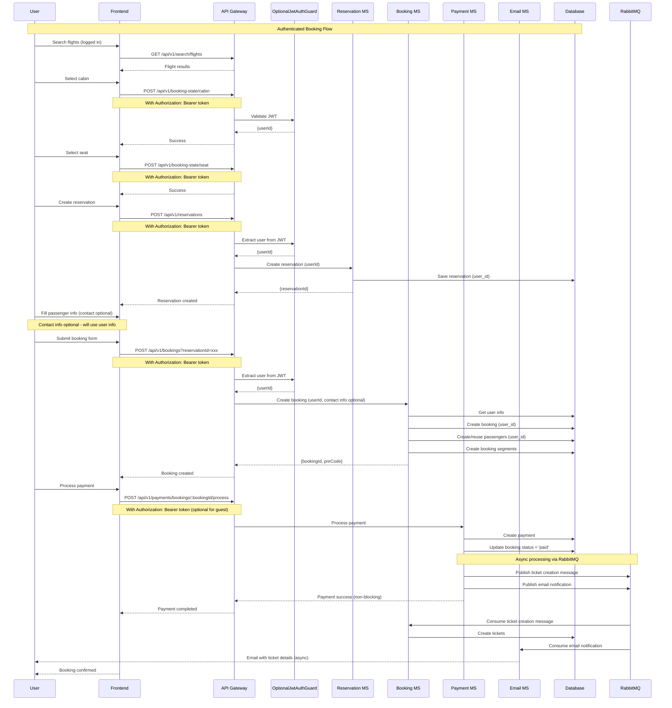
```mermaid
sequenceDiagram
    participant User
    participant Frontend
    participant API Gateway
    participant OptionalJwtAuthGuard
    participant Reservation MS
    participant Booking MS
    participant Payment MS
    participant Email MS
    participant Database

    Note over User,Database: Authenticated Booking Flow

    User->>Frontend: Search flights (logged in)
    Frontend->>API Gateway: GET /api/v1/search/flights
    API Gateway-->>Frontend: Flight results

    User->>Frontend: Select cabin
    Frontend->>API Gateway: POST /api/v1/booking-state/cabin
    Note over Frontend,API Gateway: With Authorization: Bearer token
    API Gateway->>OptionalJwtAuthGuard: Validate JWT
    OptionalJwtAuthGuard-->>API Gateway: {userId}
    API Gateway-->>Frontend: Success

    User->>Frontend: Select seat
    Frontend->>API Gateway: POST /api/v1/booking-state/seat
    Note over Frontend,API Gateway: With Authorization: Bearer token
    API Gateway-->>Frontend: Success

    User->>Frontend: Create reservation
    Frontend->>API Gateway: POST /api/v1/reservations
    Note over Frontend,API Gateway: With Authorization: Bearer token
    API Gateway->>OptionalJwtAuthGuard: Extract user from JWT
    OptionalJwtAuthGuard-->>API Gateway: {userId}
    API Gateway->>Reservation MS: Create reservation (userId)
    Reservation MS->>Database: Save reservation (user_id)
    Reservation MS-->>API Gateway: {reservationId}
    API Gateway-->>Frontend: Reservation created

    User->>Frontend: Fill passenger info (contact optional)
    Note over User,Frontend: Contact info optional - will use user info
    User->>Frontend: Submit booking form
    Frontend->>API Gateway: POST /api/v1/bookings?reservationId=xxx
    Note over Frontend,API Gateway: With Authorization: Bearer token
    API Gateway->>OptionalJwtAuthGuard: Extract user from JWT
    OptionalJwtAuthGuard-->>API Gateway: {userId}
    API Gateway->>Booking MS: Create booking (userId, contact info optional)
    Booking MS->>Database: Get user info
    Booking MS->>Database: Create booking (user_id)
    Booking MS->>Database: Create/reuse passengers (user_id)
    Booking MS->>Database: Create booking segments
    Booking MS-->>API Gateway: {bookingId, pnrCode}
    API Gateway-->>Frontend: Booking created

    User->>Frontend: Process payment
    Frontend->>API Gateway: POST /api/v1/payments/bookings/:bookingId/process
    Note over Frontend,API Gateway: With Authorization: Bearer token (optional for guest)
    API Gateway->>Payment MS: Process payment
    Payment MS->>Database: Create payment
    Payment MS->>Database: Update booking status = 'paid'
    
    Note over Payment MS,RabbitMQ: Async processing via RabbitMQ
    Payment MS->>RabbitMQ: Publish ticket creation message
    Payment MS->>RabbitMQ: Publish email notification
    Payment MS-->>API Gateway: Payment success (non-blocking)
    API Gateway-->>Frontend: Payment completed
    
    RabbitMQ->>Booking MS: Consume ticket creation message
    Booking MS->>Database: Create tickets
    
    RabbitMQ->>Email MS: Consume email notification
    Email MS-->>User: Email with ticket details (async)
    
    Frontend-->>User: Booking confirmed
```

## Payment Flow with RabbitMQ (Async Processing)

### Flow: Payment Processing with RabbitMQ Integration

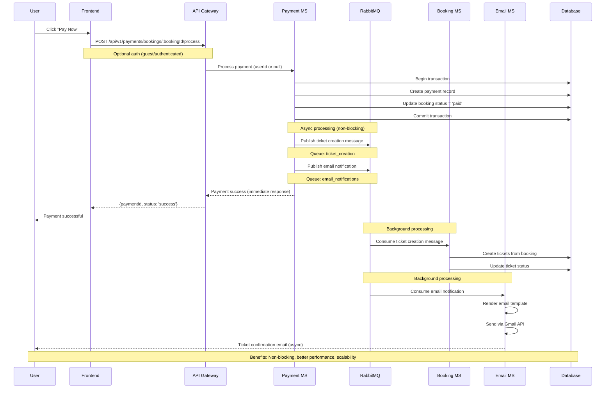
```mermaid
sequenceDiagram
    participant User
    participant Frontend
    participant API Gateway
    participant Payment MS
    participant RabbitMQ
    participant Booking MS
    participant Email MS
    participant Database

    User->>Frontend: Click "Pay Now"
    Frontend->>API Gateway: POST /api/v1/payments/bookings/:bookingId/process
    Note over Frontend,API Gateway: Optional auth (guest/authenticated)
    
    API Gateway->>Payment MS: Process payment (userId or null)
    Payment MS->>Database: Begin transaction
    Payment MS->>Database: Create payment record
    Payment MS->>Database: Update booking status = 'paid'
    Payment MS->>Database: Commit transaction
    
    Note over Payment MS,RabbitMQ: Async processing (non-blocking)
    Payment MS->>RabbitMQ: Publish ticket creation message
    Note over Payment MS,RabbitMQ: Queue: ticket_creation
    Payment MS->>RabbitMQ: Publish email notification
    Note over Payment MS,RabbitMQ: Queue: email_notifications
    
    Payment MS-->>API Gateway: Payment success (immediate response)
    API Gateway-->>Frontend: {paymentId, status: 'success'}
    Frontend-->>User: Payment successful
    
    Note over RabbitMQ,Booking MS: Background processing
    RabbitMQ->>Booking MS: Consume ticket creation message
    Booking MS->>Database: Create tickets from booking
    Booking MS->>Database: Update ticket status
    
    Note over RabbitMQ,Email MS: Background processing
    RabbitMQ->>Email MS: Consume email notification
    Email MS->>Email MS: Render email template
    Email MS->>Email MS: Send via Gmail API
    Email MS-->>User: Ticket confirmation email (async)
    
    Note over User,Database: Benefits: Non-blocking, better performance, scalability
```

## Payment Flow - Already Paid Handling

### Flow: Payment Attempt for Already Paid Booking

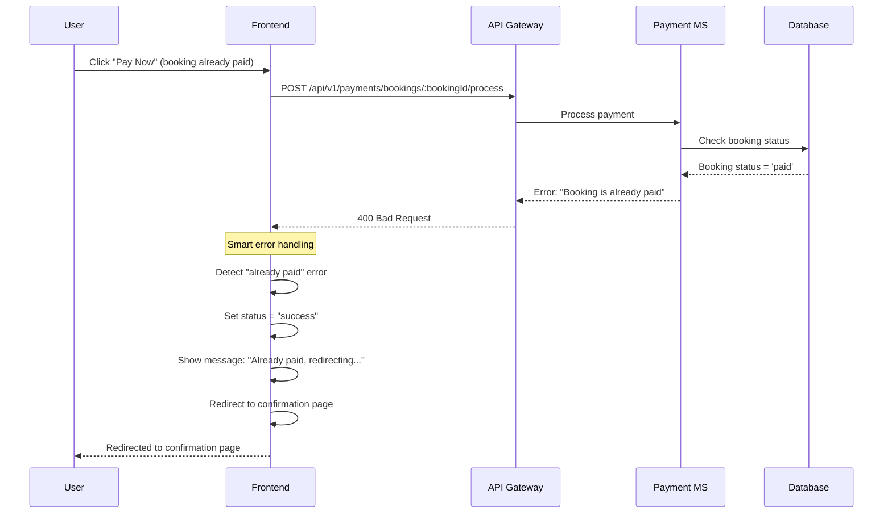
```mermaid
sequenceDiagram
    participant User
    participant Frontend
    participant API Gateway
    participant Payment MS
    participant Database

    User->>Frontend: Click "Pay Now" (booking already paid)
    Frontend->>API Gateway: POST /api/v1/payments/bookings/:bookingId/process
    
    API Gateway->>Payment MS: Process payment
    Payment MS->>Database: Check booking status
    Database-->>Payment MS: Booking status = 'paid'
    
    Payment MS-->>API Gateway: Error: "Booking is already paid"
    API Gateway-->>Frontend: 400 Bad Request
    
    Note over Frontend: Smart error handling
    Frontend->>Frontend: Detect "already paid" error
    Frontend->>Frontend: Set status = "success"
    Frontend->>Frontend: Show message: "Already paid, redirecting..."
    Frontend->>Frontend: Redirect to confirmation page
    
    Frontend-->>User: Redirected to confirmation page
```

## Cancel Booking Flow (Hybrid Cancellation Approach)

### Flow: User Cancels Entire Booking (Full Cancellation)

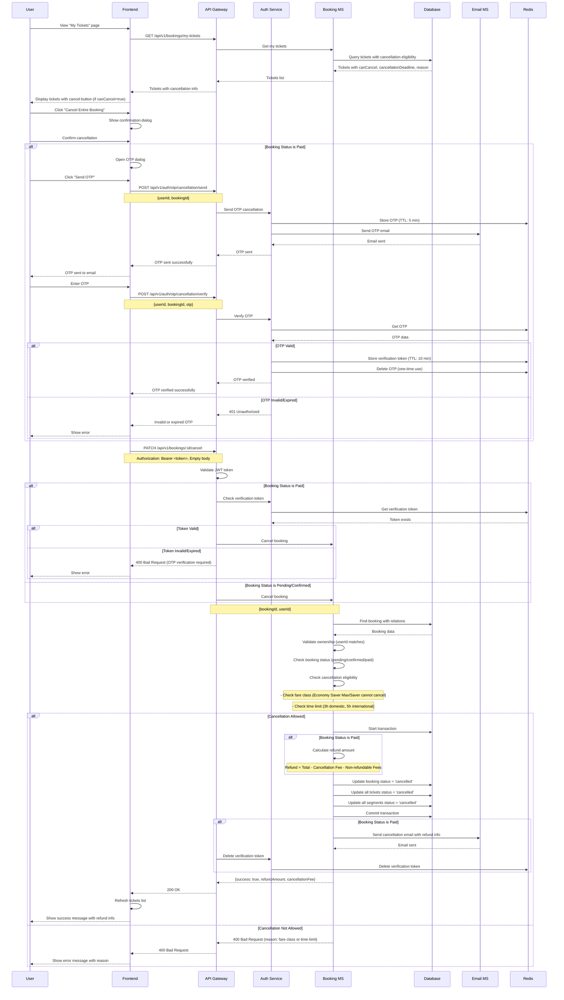
```mermaid
sequenceDiagram
    participant User
    participant Frontend
    participant API Gateway
    participant Auth Service
    participant Booking MS
    participant Database
    participant Email MS
    participant Redis

    User->>Frontend: View "My Tickets" page
    Frontend->>API Gateway: GET /api/v1/bookings/my-tickets
    API Gateway->>Booking MS: Get my tickets
    Booking MS->>Database: Query tickets with cancellation eligibility
    Database-->>Booking MS: Tickets with canCancel, cancellationDeadline, reason
    Booking MS-->>API Gateway: Tickets list
    API Gateway-->>Frontend: Tickets with cancellation info
    Frontend-->>User: Display tickets with cancel button (if canCancel=true)

    User->>Frontend: Click "Cancel Entire Booking"
    Frontend->>Frontend: Show confirmation dialog
    User->>Frontend: Confirm cancellation
    
    alt Booking Status is Paid
        Frontend->>Frontend: Open OTP dialog
        User->>Frontend: Click "Send OTP"
        Frontend->>API Gateway: POST /api/v1/auth/otp/cancellation/send
        Note over Frontend,API Gateway: {userId, bookingId}
        API Gateway->>Auth Service: Send OTP cancellation
        Auth Service->>Redis: Store OTP (TTL: 5 min)
        Auth Service->>Email MS: Send OTP email
        Email MS-->>Auth Service: Email sent
        Auth Service-->>API Gateway: OTP sent
        API Gateway-->>Frontend: OTP sent successfully
        Frontend-->>User: OTP sent to email
        
        User->>Frontend: Enter OTP
        Frontend->>API Gateway: POST /api/v1/auth/otp/cancellation/verify
        Note over Frontend,API Gateway: {userId, bookingId, otp}
        API Gateway->>Auth Service: Verify OTP
        Auth Service->>Redis: Get OTP
        Redis-->>Auth Service: OTP data
        alt OTP Valid
            Auth Service->>Redis: Store verification token (TTL: 10 min)
            Auth Service->>Redis: Delete OTP (one-time use)
            Auth Service-->>API Gateway: OTP verified
            API Gateway-->>Frontend: OTP verified successfully
        else OTP Invalid/Expired
            Auth Service-->>API Gateway: 401 Unauthorized
            API Gateway-->>Frontend: Invalid or expired OTP
            Frontend-->>User: Show error
        end
    end
    
    Frontend->>API Gateway: PATCH /api/v1/bookings/:id/cancel
    Note over Frontend,API Gateway: Authorization: Bearer <token>, Empty body
    
    API Gateway->>API Gateway: Validate JWT token
    alt Booking Status is Paid
        API Gateway->>Auth Service: Check verification token
        Auth Service->>Redis: Get verification token
        Redis-->>Auth Service: Token exists
        alt Token Valid
            API Gateway->>Booking MS: Cancel booking
        else Token Invalid/Expired
            API Gateway-->>Frontend: 400 Bad Request (OTP verification required)
            Frontend-->>User: Show error
        end
    else Booking Status is Pending/Confirmed
        API Gateway->>Booking MS: Cancel booking
    end
    
    Note over API Gateway,Booking MS: {bookingId, userId}
    
    Booking MS->>Database: Find booking with relations
    Database-->>Booking MS: Booking data
    
    Booking MS->>Booking MS: Validate ownership (userId matches)
    Booking MS->>Booking MS: Check booking status (pending/confirmed/paid)
    Booking MS->>Booking MS: Check cancellation eligibility
    Note over Booking MS: - Check fare class (Economy Saver Max/Saver cannot cancel)
    Note over Booking MS: - Check time limit (3h domestic, 5h international)
    
    alt Cancellation Allowed
        Booking MS->>Database: Start transaction
        alt Booking Status is Paid
            Booking MS->>Booking MS: Calculate refund amount
            Note over Booking MS: Refund = Total - Cancellation Fee - Non-refundable Fees
        end
        Booking MS->>Database: Update booking status = 'cancelled'
        Booking MS->>Database: Update all tickets status = 'cancelled'
        Booking MS->>Database: Update all segments status = 'cancelled'
        Booking MS->>Database: Commit transaction
        alt Booking Status is Paid
            Booking MS->>Email MS: Send cancellation email with refund info
            Email MS-->>Booking MS: Email sent
            API Gateway->>Auth Service: Delete verification token
            Auth Service->>Redis: Delete verification token
        end
        Booking MS-->>API Gateway: {success: true, refundAmount, cancellationFee}
        API Gateway-->>Frontend: 200 OK
        Frontend->>Frontend: Refresh tickets list
        Frontend-->>User: Show success message with refund info
    else Cancellation Not Allowed
        Booking MS-->>API Gateway: 400 Bad Request (reason: fare class or time limit)
        API Gateway-->>Frontend: 400 Bad Request
        Frontend-->>User: Show error message with reason
    end
```

### Flow: User Cancels Individual Ticket (Partial Cancellation)

```mermaid
sequenceDiagram
    participant User
    participant Frontend
    participant API Gateway
    participant Auth Service
    participant Booking MS
    participant Database
    participant Email MS
    participant Redis

    User->>Frontend: View "My Tickets" page
    Frontend->>API Gateway: GET /api/v1/bookings/my-tickets
    API Gateway->>Booking MS: Get my tickets
    Booking MS->>Database: Query tickets
    Database-->>Booking MS: Tickets list
    API Gateway-->>Frontend: Tickets list
    Frontend-->>User: Display tickets with "Cancel Ticket" button

    User->>Frontend: Click "Cancel This Ticket"
    Frontend->>Frontend: Show confirmation dialog
    User->>Frontend: Confirm cancellation
    
    alt Booking Status is Paid
        Frontend->>API Gateway: GET /api/v1/bookings/tickets/:ticketId/info
        API Gateway->>Booking MS: Get ticket info
        Booking MS->>Database: Get ticket with booking
        Database-->>Booking MS: Ticket info
        Booking MS-->>API Gateway: {ticketId, bookingId, bookingStatus}
        API Gateway-->>Frontend: Ticket info
        
        Frontend->>Frontend: Open OTP dialog
        User->>Frontend: Click "Send OTP"
        Frontend->>API Gateway: POST /api/v1/auth/otp/cancellation/send
        Note over Frontend,API Gateway: {userId, bookingId}
        API Gateway->>Auth Service: Send OTP cancellation
        Auth Service->>Redis: Store OTP (TTL: 5 min)
        Auth Service->>Email MS: Send OTP email
        Email MS-->>Auth Service: Email sent
        Auth Service-->>API Gateway: OTP sent
        API Gateway-->>Frontend: OTP sent successfully
        Frontend-->>User: OTP sent to email
        
        User->>Frontend: Enter OTP
        Frontend->>API Gateway: POST /api/v1/auth/otp/cancellation/verify
        Note over Frontend,API Gateway: {userId, bookingId, otp}
        API Gateway->>Auth Service: Verify OTP
        Auth Service->>Redis: Get OTP
        Redis-->>Auth Service: OTP data
        alt OTP Valid
            Auth Service->>Redis: Store verification token (TTL: 10 min)
            Auth Service->>Redis: Delete OTP (one-time use)
            Auth Service-->>API Gateway: OTP verified
            API Gateway-->>Frontend: OTP verified successfully
        else OTP Invalid/Expired
            Auth Service-->>API Gateway: 401 Unauthorized
            API Gateway-->>Frontend: Invalid or expired OTP
            Frontend-->>User: Show error
        end
    end
    
    Frontend->>API Gateway: PATCH /api/v1/bookings/tickets/:ticketId/cancel
    Note over Frontend,API Gateway: Authorization: Bearer <token>, Empty body
    
    API Gateway->>API Gateway: Validate JWT token
    alt Booking Status is Paid
        API Gateway->>Auth Service: Check verification token
        Auth Service->>Redis: Get verification token
        Redis-->>Auth Service: Token exists
        alt Token Valid
            API Gateway->>Booking MS: Cancel ticket
        else Token Invalid/Expired
            API Gateway-->>Frontend: 400 Bad Request (OTP verification required)
            Frontend-->>User: Show error
        end
    else Booking Status is Pending/Confirmed
        API Gateway->>Booking MS: Cancel ticket
    end
    
    Note over API Gateway,Booking MS: {ticketId, userId}
    
    Booking MS->>Database: Find ticket with relations
    Database-->>Booking MS: Ticket data
    
    Booking MS->>Booking MS: Validate ownership (userId matches)
    Booking MS->>Booking MS: Check ticket status (not cancelled)
    Booking MS->>Booking MS: Check booking status (pending/confirmed/paid)
    Booking MS->>Booking MS: Check cancellation eligibility for segment
    Note over Booking MS: - Check fare class
    Note over Booking MS: - Check time limit (3h domestic, 5h international)
    
    alt Cancellation Allowed
        Booking MS->>Database: Start transaction
        Booking MS->>Database: Update ticket status = 'cancelled'
        Booking MS->>Database: Update related segment status = 'cancelled'
        alt Booking Status is Paid
            Booking MS->>Booking MS: Calculate refund for segment
            Note over Booking MS: Refund = Segment Amount - Cancellation Fee - Non-refundable Fees
        end
        Booking MS->>Booking MS: Recalculate booking.total_amount
        Note over Booking MS: booking.total_amount -= segment_amount
        Booking MS->>Database: Update booking.total_amount
        Booking MS->>Database: Check if all tickets cancelled
        alt All Tickets Cancelled
            Booking MS->>Database: Update booking status = 'cancelled'
            Booking MS->>Database: Update all segments status = 'cancelled'
            Note over Booking MS: Auto-cancel booking
        end
        Booking MS->>Database: Commit transaction
        alt Booking Status is Paid
            Booking MS->>Email MS: Send cancellation email with refund info
            Email MS-->>Booking MS: Email sent
            API Gateway->>Auth Service: Delete verification token
            Auth Service->>Redis: Delete verification token
        end
        Booking MS-->>API Gateway: {success: true, refundAmount, cancellationFee, bookingCancelled}
        API Gateway-->>Frontend: 200 OK
        Frontend->>Frontend: Refresh tickets list
        alt Booking Cancelled
            Frontend-->>User: Show success + "All tickets cancelled, booking auto-cancelled"
        else Booking Still Active
            Frontend-->>User: Show success message with refund info
        end
    else Cancellation Not Allowed
        Booking MS-->>API Gateway: 400 Bad Request (reason: fare class or time limit)
        API Gateway-->>Frontend: 400 Bad Request
        Frontend-->>User: Show error message with reason
    end
```

### Cancellation Eligibility Check

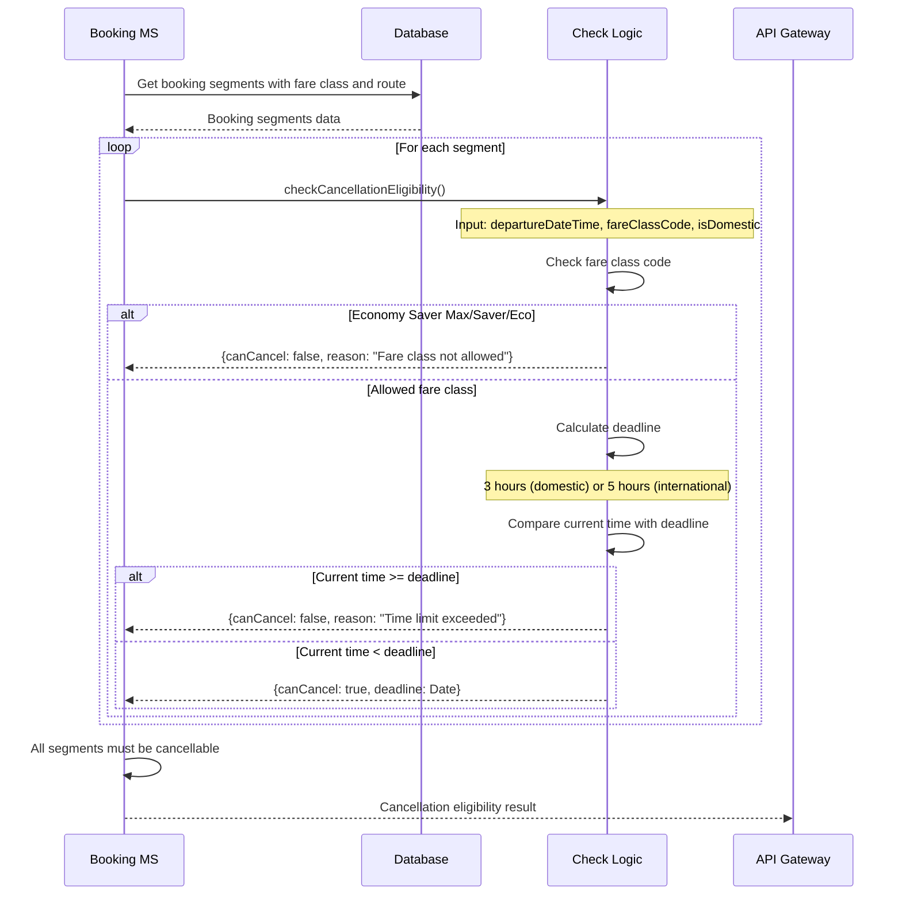
```mermaid
sequenceDiagram
    participant Booking MS
    participant Database
    participant Check Logic

    Booking MS->>Database: Get booking segments with fare class and route
    Database-->>Booking MS: Booking segments data
    
    loop For each segment
        Booking MS->>Check Logic: checkCancellationEligibility()
        Note over Check Logic: Input: departureDateTime, fareClassCode, isDomestic
        
        Check Logic->>Check Logic: Check fare class code
        alt Economy Saver Max/Saver/Eco
            Check Logic-->>Booking MS: {canCancel: false, reason: "Fare class not allowed"}
        else Allowed fare class
            Check Logic->>Check Logic: Calculate deadline
            Note over Check Logic: 3 hours (domestic) or 5 hours (international)
            Check Logic->>Check Logic: Compare current time with deadline
            
            alt Current time >= deadline
                Check Logic-->>Booking MS: {canCancel: false, reason: "Time limit exceeded"}
            else Current time < deadline
                Check Logic-->>Booking MS: {canCancel: true, deadline: Date}
            end
        end
    end
    
    Booking MS->>Booking MS: All segments must be cancellable
    Booking MS-->>API Gateway: Cancellation eligibility result
```

## Real-time WebSocket Flows

### Seat Availability Updates Flow

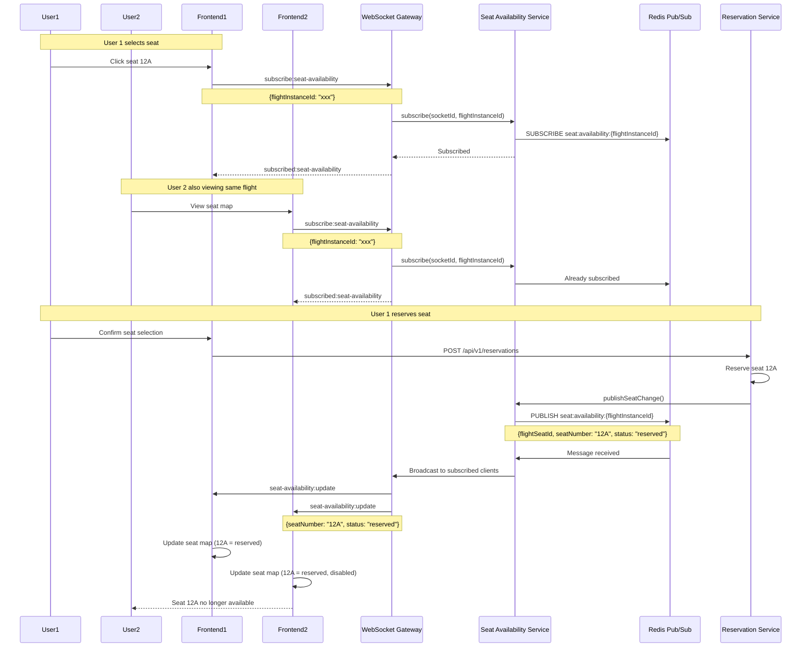
```mermaid
sequenceDiagram
    participant User1
    participant User2
    participant Frontend1
    participant Frontend2
    participant WebSocket Gateway
    participant Seat Availability Service
    participant Redis Pub/Sub
    participant Reservation Service

    Note over User1,Frontend1: User 1 selects seat
    User1->>Frontend1: Click seat 12A
    Frontend1->>WebSocket Gateway: subscribe:seat-availability
    Note over Frontend1,WebSocket Gateway: {flightInstanceId: "xxx"}
    WebSocket Gateway->>Seat Availability Service: subscribe(socketId, flightInstanceId)
    Seat Availability Service->>Redis Pub/Sub: SUBSCRIBE seat:availability:{flightInstanceId}
    Seat Availability Service-->>WebSocket Gateway: Subscribed
    WebSocket Gateway-->>Frontend1: subscribed:seat-availability

    Note over User2,Frontend2: User 2 also viewing same flight
    User2->>Frontend2: View seat map
    Frontend2->>WebSocket Gateway: subscribe:seat-availability
    Note over Frontend2,WebSocket Gateway: {flightInstanceId: "xxx"}
    WebSocket Gateway->>Seat Availability Service: subscribe(socketId, flightInstanceId)
    Seat Availability Service->>Redis Pub/Sub: Already subscribed
    WebSocket Gateway-->>Frontend2: subscribed:seat-availability

    Note over User1,Reservation Service: User 1 reserves seat
    User1->>Frontend1: Confirm seat selection
    Frontend1->>Reservation Service: POST /api/v1/reservations
    Reservation Service->>Reservation Service: Reserve seat 12A
    Reservation Service->>Seat Availability Service: publishSeatChange()
    Seat Availability Service->>Redis Pub/Sub: PUBLISH seat:availability:{flightInstanceId}
    Note over Seat Availability Service,Redis Pub/Sub: {flightSeatId, seatNumber: "12A", status: "reserved"}

    Redis Pub/Sub->>Seat Availability Service: Message received
    Seat Availability Service->>WebSocket Gateway: Broadcast to subscribed clients
    WebSocket Gateway->>Frontend1: seat-availability:update
    WebSocket Gateway->>Frontend2: seat-availability:update
    Note over WebSocket Gateway,Frontend2: {seatNumber: "12A", status: "reserved"}

    Frontend1->>Frontend1: Update seat map (12A = reserved)
    Frontend2->>Frontend2: Update seat map (12A = reserved, disabled)
    Frontend2-->>User2: Seat 12A no longer available
```

### Reservation Countdown Timer Flow

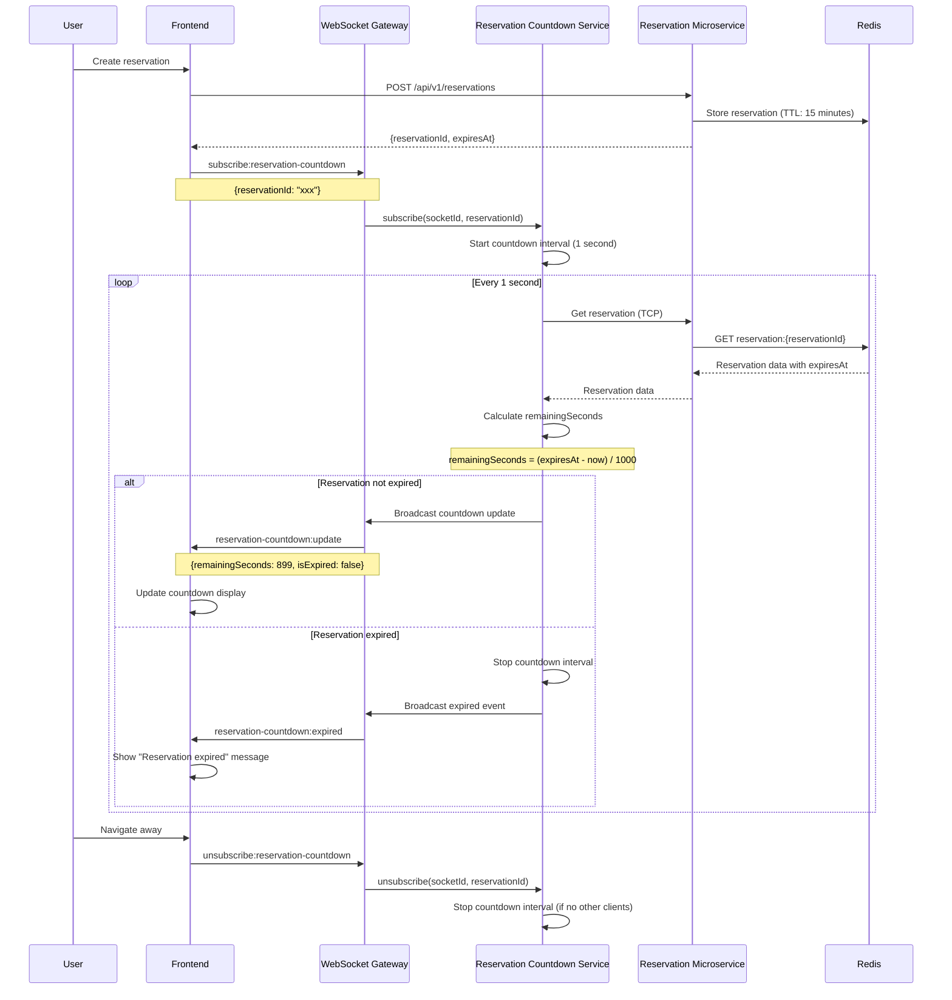
```mermaid
sequenceDiagram
    participant User
    participant Frontend
    participant WebSocket Gateway
    participant Reservation Countdown Service
    participant Reservation Microservice
    participant Redis

    User->>Frontend: Create reservation
    Frontend->>Reservation Microservice: POST /api/v1/reservations
    Reservation Microservice->>Redis: Store reservation (TTL: 15 minutes)
    Reservation Microservice-->>Frontend: {reservationId, expiresAt}

    Frontend->>WebSocket Gateway: subscribe:reservation-countdown
    Note over Frontend,WebSocket Gateway: {reservationId: "xxx"}
    WebSocket Gateway->>Reservation Countdown Service: subscribe(socketId, reservationId)
    Reservation Countdown Service->>Reservation Countdown Service: Start countdown interval (1 second)

    loop Every 1 second
        Reservation Countdown Service->>Reservation Microservice: Get reservation (TCP)
        Reservation Microservice->>Redis: GET reservation:{reservationId}
        Redis-->>Reservation Microservice: Reservation data with expiresAt
        Reservation Microservice-->>Reservation Countdown Service: Reservation data

        Reservation Countdown Service->>Reservation Countdown Service: Calculate remainingSeconds
        Note over Reservation Countdown Service: remainingSeconds = (expiresAt - now) / 1000

        alt Reservation not expired
            Reservation Countdown Service->>WebSocket Gateway: Broadcast countdown update
            WebSocket Gateway->>Frontend: reservation-countdown:update
            Note over WebSocket Gateway,Frontend: {remainingSeconds: 899, isExpired: false}
            Frontend->>Frontend: Update countdown display
        else Reservation expired
            Reservation Countdown Service->>Reservation Countdown Service: Stop countdown interval
            Reservation Countdown Service->>WebSocket Gateway: Broadcast expired event
            WebSocket Gateway->>Frontend: reservation-countdown:expired
            Frontend->>Frontend: Show "Reservation expired" message
        end
    end

    User->>Frontend: Navigate away
    Frontend->>WebSocket Gateway: unsubscribe:reservation-countdown
    WebSocket Gateway->>Reservation Countdown Service: unsubscribe(socketId, reservationId)
    Reservation Countdown Service->>Reservation Countdown Service: Stop countdown interval (if no other clients)
```

### Payment Status Updates Flow

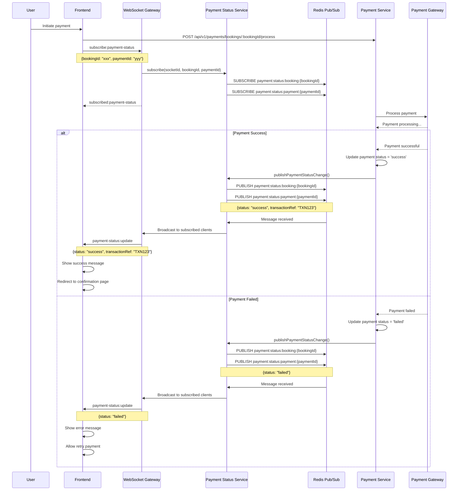
```mermaid
sequenceDiagram
    participant User
    participant Frontend
    participant WebSocket Gateway
    participant Payment Status Service
    participant Redis Pub/Sub
    participant Payment Service
    participant Payment Gateway

    User->>Frontend: Initiate payment
    Frontend->>Payment Service: POST /api/v1/payments/bookings/:bookingId/process
    Frontend->>WebSocket Gateway: subscribe:payment-status
    Note over Frontend,WebSocket Gateway: {bookingId: "xxx", paymentId: "yyy"}
    WebSocket Gateway->>Payment Status Service: subscribe(socketId, bookingId, paymentId)
    Payment Status Service->>Redis Pub/Sub: SUBSCRIBE payment:status:booking:{bookingId}
    Payment Status Service->>Redis Pub/Sub: SUBSCRIBE payment:status:payment:{paymentId}
    WebSocket Gateway-->>Frontend: subscribed:payment-status

    Payment Service->>Payment Gateway: Process payment
    Payment Gateway-->>Payment Service: Payment processing...

    alt Payment Success
        Payment Gateway-->>Payment Service: Payment successful
        Payment Service->>Payment Service: Update payment status = 'success'
        Payment Service->>Payment Status Service: publishPaymentStatusChange()
        Payment Status Service->>Redis Pub/Sub: PUBLISH payment:status:booking:{bookingId}
        Payment Status Service->>Redis Pub/Sub: PUBLISH payment:status:payment:{paymentId}
        Note over Payment Status Service,Redis Pub/Sub: {status: "success", transactionRef: "TXN123"}

        Redis Pub/Sub->>Payment Status Service: Message received
        Payment Status Service->>WebSocket Gateway: Broadcast to subscribed clients
        WebSocket Gateway->>Frontend: payment-status:update
        Note over WebSocket Gateway,Frontend: {status: "success", transactionRef: "TXN123"}

        Frontend->>Frontend: Show success message
        Frontend->>Frontend: Redirect to confirmation page
    else Payment Failed
        Payment Gateway-->>Payment Service: Payment failed
        Payment Service->>Payment Service: Update payment status = 'failed'
        Payment Service->>Payment Status Service: publishPaymentStatusChange()
        Payment Status Service->>Redis Pub/Sub: PUBLISH payment:status:booking:{bookingId}
        Payment Status Service->>Redis Pub/Sub: PUBLISH payment:status:payment:{paymentId}
        Note over Payment Status Service,Redis Pub/Sub: {status: "failed"}

        Redis Pub/Sub->>Payment Status Service: Message received
        Payment Status Service->>WebSocket Gateway: Broadcast to subscribed clients
        WebSocket Gateway->>Frontend: payment-status:update
        Note over WebSocket Gateway,Frontend: {status: "failed"}

        Frontend->>Frontend: Show error message
        Frontend->>Frontend: Allow retry payment
    end
```

### WebSocket Connection & Authentication Flow

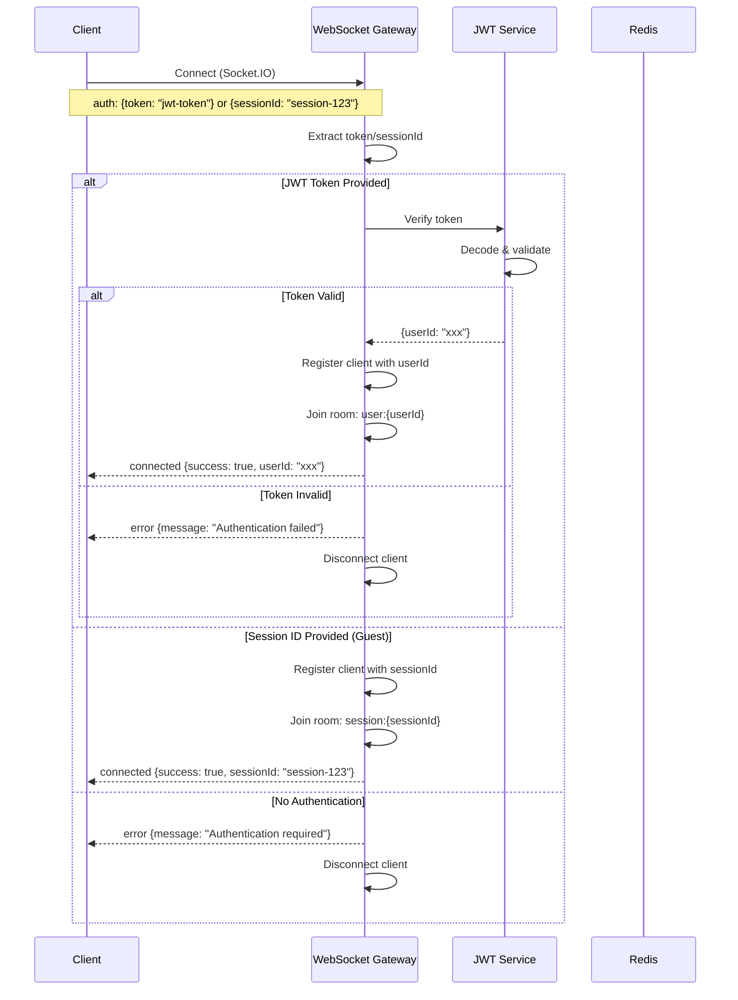
```mermaid
sequenceDiagram
    participant Client
    participant WebSocket Gateway
    participant JWT Service
    participant Redis

    Client->>WebSocket Gateway: Connect (Socket.IO)
    Note over Client,WebSocket Gateway: auth: {token: "jwt-token"} or {sessionId: "session-123"}

    WebSocket Gateway->>WebSocket Gateway: Extract token/sessionId

    alt JWT Token Provided
        WebSocket Gateway->>JWT Service: Verify token
        JWT Service->>JWT Service: Decode & validate
        alt Token Valid
            JWT Service-->>WebSocket Gateway: {userId: "xxx"}
            WebSocket Gateway->>WebSocket Gateway: Register client with userId
            WebSocket Gateway->>WebSocket Gateway: Join room: user:{userId}
            WebSocket Gateway-->>Client: connected {success: true, userId: "xxx"}
        else Token Invalid
            WebSocket Gateway-->>Client: error {message: "Authentication failed"}
            WebSocket Gateway->>WebSocket Gateway: Disconnect client
        end
    else Session ID Provided (Guest)
        WebSocket Gateway->>WebSocket Gateway: Register client with sessionId
        WebSocket Gateway->>WebSocket Gateway: Join room: session:{sessionId}
        WebSocket Gateway-->>Client: connected {success: true, sessionId: "session-123"}
    else No Authentication
        WebSocket Gateway-->>Client: error {message: "Authentication required"}
        WebSocket Gateway->>WebSocket Gateway: Disconnect client
    end
```