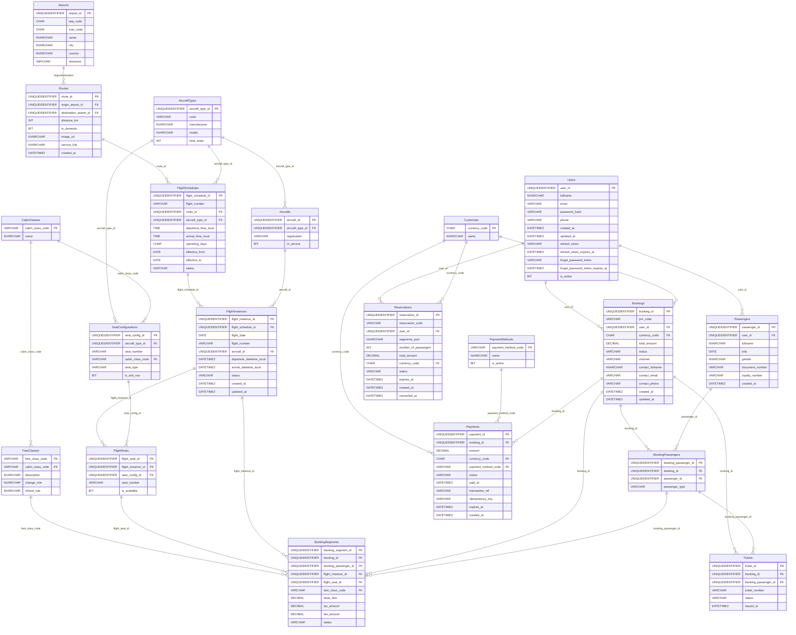

## Giải thích ngắn gọn (BE-focused)

- **Users & Passengers**
  - Users: tài khoản đăng nhập, quản lý bảo mật và trạng thái.
  - Passengers: hồ sơ hành khách dùng cho bay/ra vé; `user_id` NULL để hỗ trợ khách vãng lai/đại lý.

- **Airports & Routes**
  - Airports: chuẩn hóa IATA/ICAO, timezone phục vụ hiển thị/convert giờ.
  - Routes: unique theo cặp (origin, destination) để tránh trùng tuyến.
    - `image_url`: Đường dẫn hình ảnh deal, format `/images/routes/{route_id}.jpg` (route_id là UUID v7 - 36 ký tự, length = 55)
    - `service_link`: Link đến trang service, format `/service/{route_id}` (route_id là UUID v7 - 36 ký tự, length = 45)
    - Có CHECK constraints để validate format và đảm bảo route_id trong URL khớp với route_id của record
    - Trigger tự động generate `image_url` và `service_link` khi INSERT/UPDATE nếu NULL hoặc không đúng format

- **Fleet & Seating**
  - AircraftTypes/Aircrafts: loại tàu bay vs máy bay thực tế (registration unique).
  - CabinClasses/FareClasses: phân lớp khoang vs booking class (Y/M/B/K…).
  - SeatConfigurations: layout ghế theo loại máy bay; template sinh ghế cho chuyến thực tế.

- **Operation**
  - FlightSchedules: lịch định nghĩa (route, loại máy bay, dải hiệu lực, ngày hoạt động).
  - FlightInstances: chuyến theo ngày (copy `flight_number`, có thể gán `aircraft_id` thực tế).
  - FlightSeats: ghế của một instance; unique (instance, seat_number); cờ `is_available`.

- **Finance**
  - Currencies: mã tiền (VND/USD…).
  - PaymentMethods: từ điển phương thức thanh toán (Card/BankTransfer/Momo…).

- **Reservations (Hybrid: Database + Redis)**
  - Reservations: Giữ chỗ tạm thời trước khi tạo booking (Hybrid Approach).
    - Database: Persistent storage, audit trail, analytics (status: `pending`, `expired`, `converted`, `cancelled`).
    - Redis: Fast cache với TTL 15 phút (auto cleanup).
    - `reservation_code` unique (6 alphanumeric), `segments_json` lưu multi-segment (round-trip support).
    - Status tracking: `pending` → `converted` (khi tạo booking) hoặc `expired`/`cancelled`.
    - `converted_at`: Timestamp khi booking được tạo từ reservation này.
    - Get flow: Try Redis first (fast) → Fallback to Database → Re-cache if needed.

- **Commerce (Aggregate root: Booking)**
  - Bookings: PNR unique, `user_id` nullable, tổng tiền/trạng thái + thông tin liên hệ.
  - BookingPassengers: mapping Passenger vào Booking; unique (booking_id, passenger_id).
  - BookingSegments: mỗi hành khách trên mỗi chặng (flight_instance), có thể có `flight_seat_id`, `fare_class_code`, giá (base/tax/fee), trạng thái.
  - Tickets: vé điện tử (ticket_number unique), gắn Booking + BookingPassenger.
  - Payments: thanh toán cho Booking (số tiền, tiền tệ, phương thức, trạng thái, transaction_ref).
    - `idempotency_key`: Idempotency key để prevent duplicate payments.
    - `expires_at`: Payment expiration date (15 minutes from creation).

- **Ràng buộc chính**
  - Unique: Routes(origin,destination), FlightSchedules(flight_number,from,to), FlightInstances(flight_number,flight_date), FlightSeats(instance,seat_number), BookingPassengers(booking,passenger), Reservations.reservation_code, Bookings.pnr_code, Tickets.ticket_number.
  - FK với cascade hợp lý (xóa Booking dọn dẹp chi tiết).

- **Seat availability (logic DB)**
  - Trigger trên BookingSegments auto cập nhật `FlightSeats.is_available` khi I/U/D:
    - Gán ghế → khóa ghế (is_available=0).
    - Bỏ ghế → mở lại nếu không còn ai dùng.

- **Luồng tối thiểu**
  1) Publish mạng tuyến + lịch → generate instances theo ngày.
  2) Sinh seat map từ SeatConfigurations vào FlightSeats theo instance.
  3) Tạo Booking (PNR), add BookingPassengers, add BookingSegments (có thể chưa gán ghế).
  4) Gán/đổi ghế bằng cách cập nhật `booking_segment.flight_seat_id`.
  5) Thanh toán → phát hành Tickets, cập nhật trạng thái.

- **Thực thi/Query khuyến nghị**
  - Tìm instance theo (flight_number, flight_date) để tra cứu chặng.
  - Lấy seat map: FlightSeats by instance, join SeatConfigurations, filter `is_available`.
  - Lấy booking theo `pnr_code` (unique) và liệt kê segments/tickets/payments theo `booking_id`.