```mermaid
erDiagram
    %% ============ CORE ACTORS ============
    Users {
        UNIQUEIDENTIFIER user_id PK
        NVARCHAR fullname
        VARCHAR email
        VARCHAR password_hash
        VARCHAR phone
        DATETIME2 created_at
        DATETIME2 updated_at
        VARCHAR refresh_token
        DATETIME2 refresh_token_expires_at
        VARCHAR forgot_password_token
        DATETIME2 forgot_password_token_expires_at
        BIT is_active
    }

    Roles {
        VARCHAR role_code PK
        NVARCHAR name
        NVARCHAR description
        BIT is_active
    }

    UserRoles {
        UNIQUEIDENTIFIER user_id PK,FK
        VARCHAR role_code PK,FK
    }

    Passengers {
        UNIQUEIDENTIFIER passenger_id PK
        UNIQUEIDENTIFIER user_id FK
        NVARCHAR fullname
        DATE dob
        NVARCHAR gender
        VARCHAR document_number
        VARCHAR loyalty_number
        DATETIME2 created_at
    }

    %% ============ AIRPORTS & ROUTES ============
    Airports {
        UNIQUEIDENTIFIER airport_id PK
        CHAR iata_code
        CHAR icao_code
        NVARCHAR name
        NVARCHAR city
        NVARCHAR country
        VARCHAR timezone
    }

    Routes {
        UNIQUEIDENTIFIER route_id PK
        UNIQUEIDENTIFIER origin_airport_id FK
        UNIQUEIDENTIFIER destination_airport_id FK
        INT distance_km
        BIT is_domestic
        NVARCHAR image_url
        NVARCHAR service_link
        DATETIME2 created_at
    }

    %% ============ AIRCRAFT & SEAT CONFIG ============
    AircraftTypes {
        UNIQUEIDENTIFIER aircraft_type_id PK
        VARCHAR code
        NVARCHAR manufacturer
        NVARCHAR model
        INT total_seats
    }

    Aircrafts {
        UNIQUEIDENTIFIER aircraft_id PK
        UNIQUEIDENTIFIER aircraft_type_id FK
        VARCHAR registration
        BIT in_service
    }

    CabinClasses {
        VARCHAR cabin_class_code PK
        NVARCHAR name
    }

    FareClasses {
        VARCHAR fare_class_code PK
        VARCHAR cabin_class_code FK
        NVARCHAR description
        NVARCHAR change_rule
        NVARCHAR refund_rule
    }

    RouteFarePrices {
        UNIQUEIDENTIFIER route_fare_price_id PK
        UNIQUEIDENTIFIER route_id FK
        VARCHAR fare_class_code FK
        DECIMAL base_price
        DECIMAL tax_rate
        DECIMAL fee_rate
        DATE effective_from
        DATE effective_to
        BIT is_active
        INT priority
        NVARCHAR notes
    }

    BaggageAllowances {
        UNIQUEIDENTIFIER baggage_allowance_id PK
        VARCHAR fare_class_code FK
        INT checked_baggage_kg
        INT checked_baggage_pieces
        INT carry_on_kg
        INT carry_on_pieces
        VARCHAR carry_on_dimensions
        BIT is_domestic
        BIT is_international
        NVARCHAR notes
    }

    CabinServices {
        UNIQUEIDENTIFIER cabin_service_id PK
        VARCHAR cabin_class_code FK
        VARCHAR fare_class_code FK
        VARCHAR service_type
        NVARCHAR service_name
        NVARCHAR description
        BIT is_included
        DECIMAL price
        BIT is_active
        INT display_order
        NVARCHAR icon_url
    }

    SeatConfigurations {
        UNIQUEIDENTIFIER seat_config_id PK
        UNIQUEIDENTIFIER aircraft_type_id FK
        VARCHAR seat_number
        VARCHAR cabin_class_code FK
        VARCHAR seat_type
        BIT is_exit_row
    }

    %% ============ FLIGHT SCHEDULE / INSTANCE / SEATS ============
    FlightSchedules {
        UNIQUEIDENTIFIER flight_schedule_id PK
        VARCHAR flight_number
        UNIQUEIDENTIFIER route_id FK
        UNIQUEIDENTIFIER aircraft_type_id FK
        TIME departure_time_local
        TIME arrival_time_local
        CHAR operating_days
        DATE effective_from
        DATE effective_to
        VARCHAR status
    }

    FlightInstances {
        UNIQUEIDENTIFIER flight_instance_id PK
        UNIQUEIDENTIFIER flight_schedule_id FK
        DATE flight_date
        VARCHAR flight_number
        UNIQUEIDENTIFIER aircraft_id FK
        DATETIME2 departure_datetime_local
        DATETIME2 arrival_datetime_local
        VARCHAR status
        DATETIME2 created_at
        DATETIME2 updated_at
    }

    FlightSeats {
        UNIQUEIDENTIFIER flight_seat_id PK
        UNIQUEIDENTIFIER flight_instance_id FK
        UNIQUEIDENTIFIER seat_config_id FK
        VARCHAR seat_number
        BIT is_available
    }

    %% ============ CURRENCY / PAYMENT METHODS ============
    Currencies {
        CHAR currency_code PK
        NVARCHAR name
    }

    PaymentMethods {
        VARCHAR payment_method_code PK
        NVARCHAR name
        BIT is_active
    }

    %% ============ RESERVATIONS (Hybrid: Database + Redis) ============
    Reservations {
        UNIQUEIDENTIFIER reservation_id PK
        VARCHAR reservation_code
        UNIQUEIDENTIFIER user_id FK
        NVARCHAR segments_json
        INT number_of_passengers
        DECIMAL total_amount
        CHAR currency_code FK
        VARCHAR status
        DATETIME2 expires_at
        DATETIME2 created_at
        DATETIME2 converted_at
    }

    %% ============ BOOKINGS / SEGMENTS / TICKETS / PAYMENTS ============
    Bookings {
        UNIQUEIDENTIFIER booking_id PK
        VARCHAR pnr_code
        UNIQUEIDENTIFIER user_id FK
        CHAR currency_code FK
        DECIMAL total_amount
        VARCHAR status
        VARCHAR channel
        NVARCHAR contact_fullname
        VARCHAR contact_email
        VARCHAR contact_phone
        DATETIME2 created_at
        DATETIME2 updated_at
    }

    BookingPassengers {
        UNIQUEIDENTIFIER booking_passenger_id PK
        UNIQUEIDENTIFIER booking_id FK
        UNIQUEIDENTIFIER passenger_id FK
        VARCHAR passenger_type
    }

    BookingSegments {
        UNIQUEIDENTIFIER booking_segment_id PK
        UNIQUEIDENTIFIER booking_id FK
        UNIQUEIDENTIFIER booking_passenger_id FK
        UNIQUEIDENTIFIER flight_instance_id FK
        UNIQUEIDENTIFIER flight_seat_id FK
        VARCHAR fare_class_code FK
        DECIMAL base_fare
        DECIMAL tax_amount
        DECIMAL fee_amount
        VARCHAR status
    }

    Tickets {
        UNIQUEIDENTIFIER ticket_id PK
        UNIQUEIDENTIFIER booking_id FK
        UNIQUEIDENTIFIER booking_passenger_id FK
        VARCHAR ticket_number
        VARCHAR status
        DATETIME2 issued_at
    }

    Payments {
        UNIQUEIDENTIFIER payment_id PK
        UNIQUEIDENTIFIER booking_id FK
        DECIMAL amount
        CHAR currency_code FK
        VARCHAR payment_method_code FK
        VARCHAR status
        DATETIME2 paid_at
        VARCHAR transaction_ref
        VARCHAR idempotency_key
        DATETIME2 expires_at
        DATETIME2 created_at
    }

    %% ============ RELATIONSHIPS ============

    %% Users & Passengers & Reservations & Bookings & Roles
    Users ||--o{ Passengers   : "user_id"
    Users ||--o{ Reservations : "user_id"
    Users ||--o{ Bookings     : "user_id"
    Users }o--o{ Roles        : "UserRoles (user_id, role_code)"
    Roles ||--o{ UserRoles    : "role_code"
    Roles ||--o{ UserRoles    : "role_code"

    %% Airports & Routes
    Airports ||--o{ Routes : "origin/destination"

    %% Routes -> FlightSchedules
    Routes ||--o{ FlightSchedules : "route_id"

    %% AircraftTypes / Aircrafts / SeatConfig / FlightSchedules
    AircraftTypes ||--o{ Aircrafts           : "aircraft_type_id"
    AircraftTypes ||--o{ SeatConfigurations  : "aircraft_type_id"
    AircraftTypes ||--o{ FlightSchedules     : "aircraft_type_id"

    %% Cabin / Fare / SeatConfig / Pricing / Services
    CabinClasses ||--o{ FareClasses         : "cabin_class_code"
    CabinClasses ||--o{ SeatConfigurations  : "cabin_class_code"
    CabinClasses ||--o{ CabinServices       : "cabin_class_code"
    FareClasses  ||--o{ BookingSegments     : "fare_class_code"
    FareClasses  ||--o{ RouteFarePrices     : "fare_class_code"
    FareClasses  ||--o{ BaggageAllowances   : "fare_class_code"
    FareClasses  ||--o{ CabinServices       : "fare_class_code"
    Routes       ||--o{ RouteFarePrices      : "route_id"

    %% FlightSchedules -> FlightInstances
    FlightSchedules ||--o{ FlightInstances : "flight_schedule_id"
    Aircrafts       ||--o{ FlightInstances : "aircraft_id"

    %% FlightInstances -> FlightSeats
    FlightInstances    ||--o{ FlightSeats        : "flight_instance_id"
    SeatConfigurations ||--o{ FlightSeats        : "seat_config_id"
    FlightSeats        ||--o{ BookingSegments    : "flight_seat_id"
    FlightInstances    ||--o{ BookingSegments    : "flight_instance_id"

    %% Currency / PaymentMethods
    Currencies     ||--o{ Reservations : "currency_code"
    Currencies     ||--o{ Bookings     : "currency_code"
    Currencies     ||--o{ Payments     : "currency_code"
    PaymentMethods ||--o{ Payments : "payment_method_code"

    %% Bookings / BookingPassengers / Segments / Tickets / Payments
    Bookings          ||--o{ BookingPassengers : "booking_id"
    Passengers        ||--o{ BookingPassengers : "passenger_id"

    Bookings          ||--o{ BookingSegments   : "booking_id"
    BookingPassengers ||--o{ BookingSegments   : "booking_passenger_id"

    Bookings          ||--o{ Tickets           : "booking_id"
    BookingPassengers ||--o{ Tickets           : "booking_passenger_id"

    Bookings          ||--o{ Payments          : "booking_id"

    %% ============ DYNAMIC PRICING & SERVICES ============
    RouteFarePrices {
        UNIQUEIDENTIFIER route_fare_price_id PK
        UNIQUEIDENTIFIER route_id FK
        VARCHAR fare_class_code FK
        DECIMAL base_price
        DECIMAL tax_rate
        DECIMAL fee_rate
        DATE effective_from
        DATE effective_to
        BIT is_active
        INT priority
        NVARCHAR notes
    }

    BaggageAllowances {
        UNIQUEIDENTIFIER baggage_allowance_id PK
        VARCHAR fare_class_code FK
        INT checked_baggage_kg
        INT checked_baggage_pieces
        INT carry_on_kg
        INT carry_on_pieces
        VARCHAR carry_on_dimensions
        BIT is_domestic
        BIT is_international
        NVARCHAR notes
    }

    CabinServices {
        UNIQUEIDENTIFIER cabin_service_id PK
        VARCHAR cabin_class_code FK
        VARCHAR fare_class_code FK
        VARCHAR service_type
        NVARCHAR service_name
        NVARCHAR description
        BIT is_included
        DECIMAL price
        BIT is_active
        INT display_order
        NVARCHAR icon_url
    }
```

## Giải thích ngắn gọn (BE-focused)

- **Users & Passengers & Roles**
  - Users: tài khoản đăng nhập, quản lý bảo mật và trạng thái.
  - Passengers: hồ sơ hành khách dùng cho bay/ra vé; `user_id` NULL để hỗ trợ khách vãng lai/đại lý.
  - Roles: Vai trò trong hệ thống (CUSTOMER, ADMIN, REVENUE_ANALYST, SCHEDULE_PLANNER, etc.) - Role-Based Access Control (RBAC)
  - UserRoles: Many-to-many relationship giữa Users và Roles (một user có thể có nhiều roles, một role có thể được gán cho nhiều users)

- **Airports & Routes**
  - Airports: chuẩn hóa IATA/ICAO, timezone phục vụ hiển thị/convert giờ.
  - Routes: unique theo cặp (origin, destination) để tránh trùng tuyến.
    - `image_url`: Đường dẫn hình ảnh deal, format `/images/routes/{route_id}.jpg` (route_id là UUID v7 - 36 ký tự, length = 55)
    - `service_link`: Link đến trang service, format `/service/{route_id}` (route_id là UUID v7 - 36 ký tự, length = 45)
    - Có CHECK constraints để validate format và đảm bảo route_id trong URL khớp với route_id của record
    - Trigger tự động generate `image_url` và `service_link` khi INSERT/UPDATE nếu NULL hoặc không đúng format

- **Fleet & Seating**
  - AircraftTypes/Aircrafts: loại tàu bay vs máy bay thực tế (registration unique).
    - **Standardized Configuration**: Tất cả aircraft types đều có **180 ghế** (`total_seats = 180`)
    - **Seat Distribution**: 18 ghế Business (10%) + 162 ghế Economy (90%)
  - CabinClasses/FareClasses: phân lớp khoang vs booking class (Y/M/B/K…).
  - SeatConfigurations: layout ghế theo loại máy bay; template sinh ghế cho chuyến thực tế.
    - **Seat Naming Convention** (định nghĩa trong `src/shared/constants/seat.constants.ts`):
      - Format: `{row}{column}` (ví dụ: `1A`, `2B`, `10F`)
      - Columns: A, B, C, D, E, F (6 cột mỗi hàng)
      - Seat Types: Window (A, F), Middle (B, E), Aisle (C, D)
    - Business seats: Rows 1-3 (18 ghế)
    - Economy seats: Rows 4-30 (162 ghế)
    - **Constants**: Tên ghế được định nghĩa cố định trong business logic, seed file tuân theo constants này

- **Dynamic Pricing & Services**
  - RouteFarePrices: Giá vé động theo route và fare class, hỗ trợ effective dates và priority system.
    - `base_price`: Giá cơ bản
    - `tax_rate`: Tỷ lệ thuế (decimal, ví dụ: 0.1 = 10%)
    - `fee_rate`: Tỷ lệ phí (decimal, ví dụ: 0.05 = 5%)
    - `effective_from` / `effective_to`: Thời gian hiệu lực
    - `priority`: Độ ưu tiên (cao hơn = ưu tiên hơn khi có nhiều prices cho cùng route/fare class)
    - Fallback pricing logic nếu không tìm thấy trong database
  - BaggageAllowances: Quy định hành lý theo fare class và route type (domestic/international).
    - `checked_baggage_kg` / `checked_baggage_pieces`: Hành lý ký gửi
    - `carry_on_kg` / `carry_on_pieces` / `carry_on_dimensions`: Hành lý xách tay
    - `is_domestic` / `is_international`: Áp dụng cho route nội địa/quốc tế
  - CabinServices: Dịch vụ cabin (meals, entertainment, WiFi, priority boarding, lounge access, etc.).
    - `cabin_class_code` hoặc `fare_class_code`: Áp dụng cho cabin class hoặc fare class cụ thể
    - `service_type`: Loại dịch vụ (meal, entertainment, wifi, priority_boarding, lounge_access, seat_selection, extra_legroom, other)
    - `is_included`: Dịch vụ miễn phí (true) hoặc có giá (false)
    - `price`: Giá dịch vụ (null nếu is_included = true)
    - `display_order`: Thứ tự hiển thị trong UI

- **Operation**
  - FlightSchedules: lịch định nghĩa (route, loại máy bay, dải hiệu lực, ngày hoạt động).
  - FlightInstances: chuyến theo ngày (copy `flight_number`, có thể gán `aircraft_id` thực tế).
  - FlightSeats: ghế của một instance; unique (instance, seat_number); cờ `is_available`.

- **Finance**
  - Currencies: mã tiền (VND/USD…).
  - PaymentMethods: từ điển phương thức thanh toán (Card/BankTransfer/Momo…).

- **Reservations (Hybrid: Database + Redis)**
  - Reservations: Giữ chỗ tạm thời trước khi tạo booking (Hybrid Approach).
    - Database: Persistent storage, audit trail, analytics (status: `pending`, `expired`, `converted`, `cancelled`).
    - Redis: Fast cache với TTL 15 phút (auto cleanup).
    - `reservation_code` unique (6 alphanumeric), `segments_json` lưu multi-segment (round-trip support).
    - Status tracking: `pending` → `converted` (khi tạo booking) hoặc `expired`/`cancelled`.
    - `converted_at`: Timestamp khi booking được tạo từ reservation này.
    - Get flow: Try Redis first (fast) → Fallback to Database → Re-cache if needed.

- **Commerce (Aggregate root: Booking)**
  - Bookings: PNR unique, `user_id` nullable, tổng tiền/trạng thái + thông tin liên hệ.
  - BookingPassengers: mapping Passenger vào Booking; unique (booking_id, passenger_id).
  - BookingSegments: mỗi hành khách trên mỗi chặng (flight_instance), có thể có `flight_seat_id`, `fare_class_code`, giá (base/tax/fee), trạng thái.
  - Tickets: vé điện tử (ticket_number unique), gắn Booking + BookingPassenger.
  - Payments: thanh toán cho Booking (số tiền, tiền tệ, phương thức, trạng thái, transaction_ref).
    - `idempotency_key`: Idempotency key để prevent duplicate payments.
    - `expires_at`: Payment expiration date (15 minutes from creation).

- **Ràng buộc chính**
  - Unique: Routes(origin,destination), FlightSchedules(flight_number,from,to), FlightInstances(flight_number,flight_date), FlightSeats(instance,seat_number), BookingPassengers(booking,passenger), Reservations.reservation_code, Bookings.pnr_code, Tickets.ticket_number.
  - FK với cascade hợp lý (xóa Booking dọn dẹp chi tiết).

- **Seat availability (logic DB)**
  - Trigger trên BookingSegments auto cập nhật `FlightSeats.is_available` khi I/U/D:
    - Gán ghế → khóa ghế (is_available=0).
    - Bỏ ghế → mở lại nếu không còn ai dùng.

- **Luồng tối thiểu**
  1) Publish mạng tuyến + lịch → generate instances theo ngày.
  2) Sinh seat map từ SeatConfigurations vào FlightSeats theo instance.
  3) Tạo Booking (PNR), add BookingPassengers, add BookingSegments (có thể chưa gán ghế).
  4) Gán/đổi ghế bằng cách cập nhật `booking_segment.flight_seat_id`.
  5) Thanh toán → phát hành Tickets, cập nhật trạng thái.

- **Thực thi/Query khuyến nghị**
  - Tìm instance theo (flight_number, flight_date) để tra cứu chặng.
  - Lấy seat map: FlightSeats by instance, join SeatConfigurations, filter `is_available`.
  - Lấy booking theo `pnr_code` (unique) và liệt kê segments/tickets/payments theo `booking_id`.

## ERD phụ (planned): Audit / Log tables

> Lưu ý: Các bảng dưới đây là đề xuất thiết kế **future-proof** cho logging/audit, chưa được tạo trong migrations hiện tại.  
> Khi chốt yêu cầu, sẽ thêm migrations tương ứng để sync với ERD này.

```mermaid
erDiagram
    %% ============ AUDIT / LOG TABLES (PLANNED) ============
    BookingAuditLogs {
        UNIQUEIDENTIFIER booking_audit_id PK
        UNIQUEIDENTIFIER booking_id FK
        UNIQUEIDENTIFIER user_id FK
        VARCHAR actor_type        -- 'user' | 'system' | 'job'
        VARCHAR action            -- 'created' | 'updated' | 'cancelled' | 'seat_changed' | 'paid' | 'refunded'
        NVARCHAR details_json     -- JSON chi tiết diff/thêm thông tin
        DATETIME2 created_at
    }

    PaymentAuditLogs {
        UNIQUEIDENTIFIER payment_audit_id PK
        UNIQUEIDENTIFIER payment_id FK
        UNIQUEIDENTIFIER booking_id FK
        VARCHAR status_before
        VARCHAR status_after
        NVARCHAR gateway_response_json   -- payload từ payment gateway (masked)
        DATETIME2 created_at
    }

    SeatChangeLogs {
        UNIQUEIDENTIFIER seat_change_id PK
        UNIQUEIDENTIFIER booking_segment_id FK
        UNIQUEIDENTIFIER booking_id FK
        UNIQUEIDENTIFIER flight_instance_id FK
        UNIQUEIDENTIFIER old_flight_seat_id FK
        UNIQUEIDENTIFIER new_flight_seat_id FK
        VARCHAR reason
        UNIQUEIDENTIFIER changed_by_user_id FK
        DATETIME2 created_at
    }

    OtpAuditLogs {
        UNIQUEIDENTIFIER otp_audit_id PK
        UNIQUEIDENTIFIER user_id FK
        UNIQUEIDENTIFIER booking_id FK
        VARCHAR type           -- 'cancellation' | 'login' | ...
        VARCHAR channel        -- 'email' | 'sms'
        VARCHAR status         -- 'sent' | 'verified' | 'failed' | 'expired'
        NVARCHAR metadata_json -- IP, user-agent, retryCount...
        DATETIME2 created_at
    }

    %% RELATIONSHIPS (PLANNED)
    Bookings       ||--o{ BookingAuditLogs : "booking_id"
    Users          ||--o{ BookingAuditLogs : "user_id"

    Bookings       ||--o{ PaymentAuditLogs : "booking_id"
    Payments       ||--o{ PaymentAuditLogs : "payment_id"

    Bookings       ||--o{ SeatChangeLogs   : "booking_id"
    BookingSegments||--o{ SeatChangeLogs   : "booking_segment_id"
    FlightInstances||--o{ SeatChangeLogs   : "flight_instance_id"
    FlightSeats    ||--o{ SeatChangeLogs   : "old/new_flight_seat_id"
    Users          ||--o{ SeatChangeLogs   : "changed_by_user_id"

    Users          ||--o{ OtpAuditLogs     : "user_id"
    Bookings       ||--o{ OtpAuditLogs     : "booking_id"
```